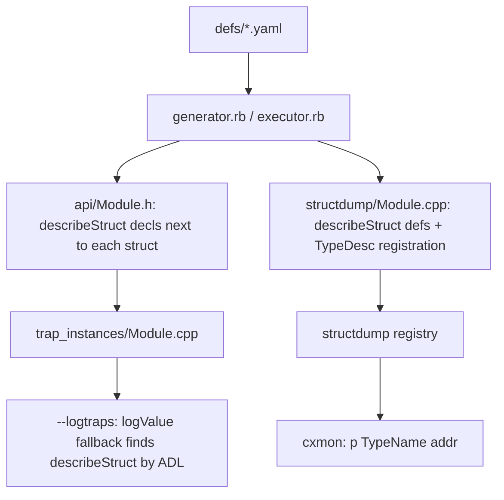

# Generator-produced struct introspection for debugging

> Date: 2026-09-29
> Status: implemented

## Goal

Inspecting struct arguments (parameter blocks in particular) previously required
ad-hoc, per-site instrumentation. The multiversal generator now emits, for every
yaml-defined struct/union, a type-aware description facility used by:

1. `--logtraps`, to decode parameter blocks automatically (`ParmBlkPtr`,
   `HParmBlkPtr`, `CInfoPBPtr`, `FCBPBPtr`, …), and
2. the cxmon debugger (`p` command), to dump **any named type at any guest
   address** without recompiling.

## Data flow



## Design constraints

- **Always on.** Not gated behind `EXECUTOR_ENABLE_LOGGING` or a new option; the
  type registry is available to the debugger at all times.
- **Declarations in the normal generated headers.** For `--logtraps` the
  declarations must be visible where trap implementations are compiled
  (`trap_instances/*.cpp`), so they go into `api/*.h` next to each struct. There
  is no separate generator: this is an extension of `ExecutorGenerator`, in the
  single `make-multiverse.rb -G Executor` pass.
- **Implementations in `.cpp` files.** Headers carry only a declaration per type;
  the code goes into generated `structdump/*.cpp`.
- **No pointer recursion inside structs.** `describeStruct` never follows a
  pointer-to-struct member; the member's raw guest address is printed instead.
  The only place a pointer-to-struct is expanded is a trap parameter while
  logging, and there the address is printed *in addition to* the decoded struct.
  Struct expansion therefore nests only by value, which is acyclic and finite, so
  no depth guard is needed.

## Generated `describeStruct`

The customization point is an ordinary function found by ADL:

```cpp
// declared in namespace Executor, next to the type
void describeStruct(const FInfo&, std::ostream&);
```

`logging` supplies a generic fallback that prints `?`, so no detection/SFINAE is
needed — normal overload resolution prefers a generated non-template overload
when one is visible:

```cpp
namespace Executor::logging {
template<typename T>
void describeStruct(const T&, std::ostream& os) { os << "?"; }  // fallback

template<typename T>
void logValue(const T& arg) { describeStruct(arg, std::clog); }
}
```

Value formatting is ostream-parameterised so the same printer serves both
`--logtraps` and cxmon:

- `logValueTo(std::ostream&, x)` — the real formatter (a set of overloads for the
  scalar types, plus the generic wrapper/pointer/array/enum/struct cases).
- `logField(std::ostream&, "name", x)` — a labelled field, used by generated code.
- `logValue(x)` forwards to `logValueTo(std::clog, x)`.

Pointer/array/enum handling lives in one generic `logValueTo` overload using
`if constexpr`, which avoids array-to-pointer overload ambiguity. The generic and
`GuestWrapper` overloads are forward-declared so they can call one another.

## Runtime registry

`src/base/structdump.h/.cpp` (hand-written mechanism, not types):

- `TypeDesc { const char* name; size_t size; void (*print)(std::ostream&, const void*); }`
- `registerTypes` / `findType` (lazily triggers `registerAllStructDumps`) /
  `dumpType(os, name, guestAddr, count)`.
- The generated per-module `structdump/<Module>.cpp` also emits a `dump_<Type>`
  thunk and `registerStructDumps_<Module>()`; a generated
  `structdump/ReferenceAllStructDumps.cpp` references every module so the linker
  keeps them all (mirrors `ReferenceAllTraps`).

## Integration points

- **`--logtraps`**: no new call sites. The `logValue` pointer overloads already
  print the pointer and then dereference once, so a pointer-to-struct trap
  parameter becomes `0x40b8216 => ParamBlockRec{…}`. Struct members that are
  pointers stay address-only.
- **cxmon**: `p "Type" addr [count]` in `src/debug/mon_debugger.cpp`, using
  `findType` + `dumpType`; counts consecutive records.
- **`--logtraps-filter "PB*,FS*"`**: `logging::setTrapFilter` /
  `trapLogEnabled` restrict `--logtraps` to trap names matching comma-separated
  `*`/`?` wildcards; honoured by `logTrapCall`/`…Return` and the untyped path.
  Kept as a separate flag because `--logtraps` is a `bool_switch` and an
  optional-value form would swallow the positional app path.

## Field-kind rules

| Member kind | Rendering |
|---|---|
| scalar (`uint8_t`…`uint64_t`, `char`, `bool`, `float`, `double`, Mac typedefs) | `logValueTo` overloads (integers also show packed `'TEXT'`) |
| `GUEST<T>` / `GuestWrapper<T>` | unwrap, then render `T` |
| struct/union by value | recursive `describeStruct` |
| pointer, including pointer-to-struct | raw guest address, never dereferenced |
| fixed-size array | `[a, b, c]` elementwise |
| `unsigned char[N]` / `Str255` / `Str63` | Pascal string (`"\pName"`) |
| enum | numeric value |
| union | every arm labelled |
| `common:` macro (`COMMONFSQUEUEDEFS`) | members expanded and rendered |
| anonymous nested struct/union | rendered inline with a dotted label path |

## Generator details and edge cases

- The declaration is emitted immediately after `declare_struct_union` (always on);
  the preamble adds `#include <iosfwd>`.
- `structdump/<Module>.cpp` defines each `describeStruct` and its registration.
- **Incomplete types** (forward declarations, no members) get nothing — `sizeof`
  and field access need completeness.
- **Opaque-then-full duplicates** within a module (`SProcRec`, `GDevice`): keep
  the richest definition.
- **A type defined in two modules** (`QElem` opaque in MacTypes, full in OSUtil):
  describe it only in the module with the fullest definition, avoiding duplicate
  symbols.
- **Conditionally compiled types** (`extended96` under `#if defined(mc68000)` in
  SANE): verbatim `#if`/`#endif` nesting is tracked and such types are skipped.
- Non-type items (`function`, `funptr`, `lowmem`, `verbatim`, `dispatcher`) are
  ignored; `only-for`/`not-for`/`api` filtering is already applied by `HeaderFile`.

## Hand-written types

`Point` is defined in `mactype.h` and marked `not-for: executor` in
`MacTypes.yaml`, so it has no generated description. A hand-written
`describeStruct(const Point&, std::ostream&)` is declared there and defined in
`base/logging.cpp`, so fields such as `fdLocation` print. Other hand-written
structs (in `ctl.h`, `dial.h`, `emustubs.h`, `apple_events.h`) still render as
`?`.

## Implementation phases

The work was done in four steps; Phase 0 was a throwaway spike, Phases 1–3 are
the delivered feature.

- **Phase 0 — PoC (spike).** Hand-wrote `describeStruct` for `HFileParam` and the
  `logging.h` fallback, and hand-emitted the declaration into the generated
  `FileMgr.h`, to validate the ADL/declaration-ordering assumption (that the
  declaration placed next to the type is visible at the `--logtraps` instantiation
  point in `trap_instances/*.cpp`). The scratch code was discarded once Phase 1
  produced the same declarations from the generator.
- **Phase 1 — generator emits the printers.** `ExecutorGenerator` emits the
  per-type declarations and the `structdump/<Module>.cpp` definitions
  (`describe_members`/`describe_struct`/`generate_structdump`); CMake compiles the
  generated sources into `romlib`. `--logtraps` decoding works at this point.
- **Phase 2 — registry + debugger command.** `structdump.{h,cpp}`, the per-module
  registration and central reference, and the `p` command.
- **Phase 3 — polish.** `Point`, and the `--logtraps-filter` option.

## Files

| File | Role |
|---|---|
| `multiversal/executor.rb` | emit `describeStruct` decls + `structdump/*.cpp` + registration |
| `src/base/logging.h` / `.cpp` | `describeStruct` fallback, `logValueTo`/`logField`, trap filter, `Point` |
| `src/base/structdump.h` / `.cpp` | runtime registry: `TypeDesc`, `findType`, `dumpType` |
| `src/base/mactype.h` | `Point` declaration |
| `src/base/traps.h` / `.cpp`, `src/main.cpp` | `--logtraps-filter` plumbing |
| `src/CMakeLists.txt` | generated `structdump_sources` |
| `src/debug/mon_debugger.cpp` | `p` command |
| `docs/subsystems/debugger.md`, `executor-guest-debugging` skill | documentation |

## Testing

- `tests/guestvalues.cpp` has six `structdump` tests: `logValueDescribesGeneratedStruct`
  (nested struct), `logValueDescribesUnion` (union arms), `registryFindType` and
  `registryPrints` (the registry is fully linked and populated), `describesPoint`,
  and `trapFilter`.
- The full native suite is otherwise unchanged (the known `FileTest` `xfail`s and
  network-gated `MacTCP` tests aside).
- Live `--headless` runs against MacWrite II: `--logtraps` decodes parameter
  blocks (`PBGetFInfo/PBHGetFInfo(0x40b8216 => ParamBlockRec{ioParam=IOParam{…}
  ioNamePtr=… "\pMacWrite II" …} fileParam=FileParam{… ioFlFndrInfo=FInfo{fdType=…
  'APPL' …} …} cntrlParam=CntrlParam{… csParam=[0, 8192, …]} }, 0, 0)`);
  `p "ParamBlockRec" $40b8216` prints the same via the registry; and
  `--logtraps --logtraps-filter "PB*"` cuts the output from ~54k to 76 lines.

## Not done

- Enum-value names (e.g. `OSErr` codes) — needs per-enum tables.
- Filler-field suppression — lossy, so not enabled.
- A size-aware `validAddress(p, len)` for the pointer-deref guards (today only the
  start byte is checked, so a struct/string that spans a mapping-window boundary
  could still fault).
