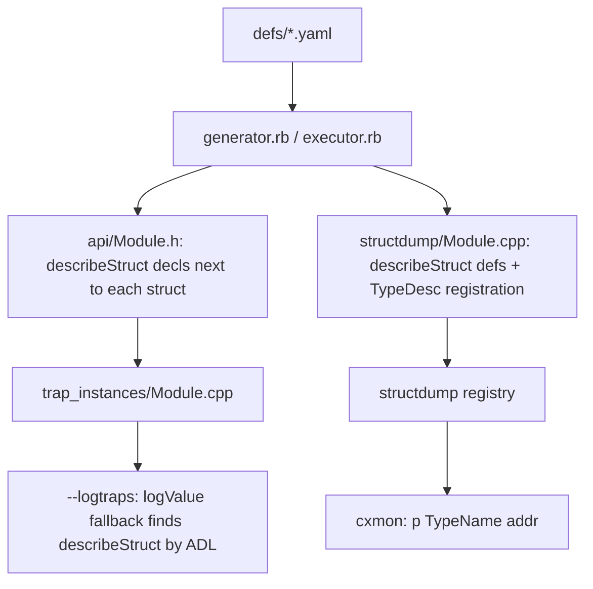

# Plan: generator-produced struct introspection for debugging

> Date: 2026-09-29
> Status: plan (not yet implemented)

## 1. Goal

Stop hand-writing per-site `[sfTrace]`-style instrumentation. Instead have the
multiversal generator emit, for **every** yaml-defined struct/union, a type-aware
description facility that:

1. makes `--logtraps` decode parameter blocks automatically (`ParmBlkPtr`,
   `HParmBlkPtr`, `CInfoPBPtr`, `FCBPBPtr`, …), and
2. gives the debugger/cxmon a way to dump **any named type at any guest
   address** without recompiling.

This generalizes and supersedes recommendation §6.1 of
`docs/ai/2026-09-27-debugging-instrumentation-review.md` (which proposed
hand-writing `logValue` overloads for a handful of File Manager types).

The primary consumer is the cxmon debugger (`p` command); automatic trap
decoding is a side benefit of the same generated code.

## 2. Why the generator is the right lever

The generator already has everything needed to walk the structure:

- `declare_members` already recurses through `member["struct"]`,
  `member["union"]`, `member["common"]`, arrays, and pointers.
- `$global_name_map` resolves `common:` macro members (`COMMONFSQUEUEDEFS`) and
  lets a type be classified as primitive / pointer / array / struct / typedef.
- `Defs#topsort` gives module include order for cross-module forward
  declarations.

So this is mostly *re-emitting what `declare_members` already traverses* in a
different form, not new parsing.

## 3. Design constraints (decided)

- **Always on.** Not gated behind `EXECUTOR_ENABLE_LOGGING` or a new option. The
  registry of dumpable types must be available to the debugger at all times.
- **Declarations in the normal generated headers.** For `--logtraps` the
  declarations must be visible where trap implementations are compiled
  (`trap_instances/*.cpp`), so they go into `api/*.h` next to each struct. There
  is **no separate generator** in `multiversal`; this is an extension of
  `ExecutorGenerator` (single `make-multiverse.rb -G Executor` pass).
- **Implementations in `.cpp` files.** Headers carry only a plain function
  declaration per type; the code goes into generated `structdump/*.cpp`.
- **No pointer recursion inside structs.** `describeStruct` never follows a
  pointer-to-struct member, so the pointee is never printed; the member's raw
  guest address is printed instead. The *only* place a pointer-to-struct is
  expanded is a trap function parameter while logging — and there the address is
  printed *in addition to* the decoded struct (see §8). Consequently struct
  expansion nests only by value, which is acyclic and finite, so no depth guard
  is needed.

## 4. Two complementary outputs from one traversal

| Output | Consumer | Why |
|---|---|---|
| `describeStruct(const T&, std::ostream&)` per type (code-generated, declared in `api/*.h`, defined in `structdump/*.cpp`) | `--logtraps` via `logValue`, and the cxmon `p` command | Type-safe, exact field names, recurses through nested-by-value structs |
| Per-type registry entry (`name`, `sizeof`, printer; optionally `{field, offset, kind}`) | cxmon `p` command, future tools | Name→type dispatch at runtime; "layout metadata for all types" |

The printer functions are the foundation; the registry is a thin table on top.
Explicit offsets can be added with `offsetof` only if a tool needs structured
access — this avoids requiring the generator to compute alignment/size layouts
itself, which it currently does not do reliably (`size_of_type` returns `4` for
any array/pointer).

## 5. Data flow



## 6. Runtime library (new, hand-written)

`src/base/structdump.h/.cpp` (small, hand-written; the *mechanism*, not the
*types*):

- `describeStruct(const T&, std::ostream&)` is the customization point, found by
  **ADL** (generated overloads live in `namespace Executor`, the associated
  namespace of the generated types).
- No detection/SFINAE needed: `logging` provides a **generic fallback overload**
  that prints `?`, and normal overload resolution prefers a generated
  non-template overload when one is visible.
  ```cpp
  namespace Executor::logging {
  template<typename T>
  void describeStruct(const T&, std::ostream& os) { os << "?"; }  // fallback

  template<typename T>
  void logValue(const T& arg) { describeStruct(arg, std::clog); }
  }
  ```
  Generated code adds, in namespace `Executor`,
  `void describeStruct(const T&, std::ostream&);`.
- `TypeDesc { name, size, void(*print)(std::ostream&, const void*) }` +
  `registerType` / `findType`.
- `dumpType(std::string_view name, uint32_t guestAddr, std::ostream&)` for the
  debugger command.

**ostream-core refactor (needed for the `p` command).** The generated
`describeStruct` must write both field names and values to an arbitrary
`std::ostream`. Today `logValue` is hard-wired to `std::clog`. Refactor to an
ostream-parameterized core:

- `logValueTo(std::ostream&, x)` — the real implementation.
- existing `logValue(x)` forwards to `logValueTo(std::clog, x)`.

Then the same generated printer serves both `--logtraps` and cxmon.
(`logging.cpp` is always compiled, so this is available always.)

## 7. Generator changes (`multiversal/`, `ExecutorGenerator`)

Extend `ExecutorGenerator` so one `make-multiverse.rb -G Executor` pass emits
everything. Per module:

1. **In `api/<Module>.h`, immediately after each `declare_struct_union`** (always
   on, no `#ifdef`):
   ```cpp
   void describeStruct(const FInfo&, std::ostream&);
   ```
   Emitting it *right after the type* guarantees it precedes any trap signature
   that uses the type (the yaml must already order types before their uses), so
   the `--logtraps` instantiation point in `trap_instances/<Module>.cpp` sees it.
   Forward-declare `namespace std { class ostream; }` (or `#include <iosfwd>`) in
   the preamble.
2. **`structdump/<Module>.cpp`** defining each `describeStruct`, recursing into
   nested-**by-value** struct/union types by calling their `describeStruct`, and
   printing primitive values via `logValueTo`.
3. **A registration function** per module (referenced from one central list,
   mirroring `ReferenceAllTraps.cpp`, to defeat dead-stripping and static-init
   order issues), e.g. `structdump/<Module>Dump.cpp` called from a generated
   `ReferenceAllStructDumps.cpp`.
4. Add `structdump/<Module>.cpp` and the generated headers to the source lists in
   `src/CMakeLists.txt`, and the new outputs to the
   `add_custom_command(OUTPUT ...)`.

### Field-kind handling (all driven by the resolver)

- **common** (`COMMONFSQUEUEDEFS`): expand to real member names via
  `$global_name_map` (`@expand_common` is already supported).
- **arrays** (`INTEGER[11]`, `uint16_t[4]`): loop with index.
- **Pascal-string typedefs** (`Str255`, `Str63`, `StringPtr`, `ConstStringPtr`):
  print as `"\pName"`. This also fixes the `ConstStringPtr`-prints-one-byte bug
  noted in review §5.
- **pointers, including pointers to structs**: print the raw guest address;
  **never dereference** (see §3). This is where the new policy differs from
  generic `logValue`, which does dereference one level.
- **enums** (`OSType`/type/creator, selector enums): print the numeric value; add
  a name where the value table is known.
- **unions** (`ParamBlockRec`, `CInfoPBRec`): print each arm labeled; optionally
  choose an arm from a discriminator later.
- **nested anonymous struct/union members** (`member["struct"]`/`["union"]`):
  recurse inline (by value).
- Skip non-type items (`function`, `funptr`, `lowmem`, `verbatim`, `dispatcher`);
  respect `only-for`/`not-for`/`api` filtering already applied by `HeaderFile`.

## 8. Integration points

- **`--logtraps`**: no new call sites — the `logging.h` fallback change plus the
  ADL-visible generated `describeStruct` declarations turn
  `PBGetFInfo/PBHGetFInfo(0x40b4e62 => ?)` into a decoded record. Because the
  `logValue` pointer overloads already print the pointer first and then deref
  once, a pointer-to-struct trap parameter shows its **address plus the decoded
  struct** (`0x40b4e62 => { ioFDirIndex=…, ioFlFndrInfo={fdType=…}, … }`). Struct
  members that are pointers stay address-only.
- **cxmon command** in `src/debug/mon_debugger.cpp`, e.g.
  `p <TypeName> <addr> [count]`, using `findType` + `dumpType`. Always
  available; the registration list must be linked into the binary (not stripped).
- Optionally a `--debug structdump` category or an
  `Executor::debug::dumpStruct()` helper for use from code/tests.

## 9. Work plan (phased)

**Phase 0 — PoC (de-risk the tricky part first)**

- Hand-write `describeStruct` for `HFileParam` + the `logging.h` ADL detection.
- Confirm from a `trap_instances`-like TU that `--logtraps` resolves it
  (validates two-phase/ADL/declaration-ordering assumptions).
- If ADL visibility proves unreliable, fall back to explicit specializations
  declared in the api header.

**Phase 1 — generator emits printers for all structs/unions**

- Extend `executor.rb` to emit the `describeStruct` decls (inline, after each
  struct) + `structdump/*.cpp`.
- Wire CMake; verify the tree builds and generated headers stay diff-stable.
- Validate on the `rfNumErr` scenario: `--logtraps` should now subsume the
  removed `[sfTrace]` sites in `hfsXbar.cpp`/`localvolume.cpp`/`fileMisc.cpp`.

**Phase 2 — registry + debugger command**

- `TypeDesc` registry, central `ReferenceAllStructDumps`, `p` cxmon command.
- Add optional structured `FieldDesc[]` (name/offset/kind via `offsetof`) if a
  consumer needs offsets.

**Phase 3 — polish**

- String/enum/union/array formatting, filler suppression, filters for
  `--logtraps` (review §6.3).
- Tests + docs.

## 10. Files touched

| File | Change |
|---|---|
| `multiversal/generator.rb`, `multiversal/executor.rb` | emit `describeStruct` + registry regs |
| `src/base/logging.h` / `.cpp` | ADL detection, ostream-core refactor |
| `src/base/structdump.h` / `.cpp` | **new** runtime registry + generic dumper |
| `src/CMakeLists.txt` | new generated outputs/sources |
| `src/debug/mon_debugger.cpp` | `p` command |
| `tests/` | gtest for describe + generator output test |
| `docs/subsystems/debugger.md`, `docs/ai/2026-09-27-…` | document; mark review §6.1 superseded |

## 11. Risks / open questions

1. **ADL/two-phase visibility** is the main technical risk — validate in Phase 0.
   Mitigation: declare `describeStruct` in the module header directly after the
   type.
2. **`offsetof`/standard-layout** (only if we emit offsets): fine for these
   structs (no virtuals/references; `GUEST_STRUCT` declares an empty nested type,
   not a member) — verify for the union-heavy types.
3. **Coverage gap**: hand-written structs (`ctl.h`, `dial.h`, `emustubs.h`,
   `apple_events.h`) aren't in yaml and stay `?` unless added to defs or given
   hand-written describe.
4. **`Point`** is hand-written in `mactype.h` but present in `MacTypes.yaml`;
   ensure no duplicate/conflicting emission.
5. **Header weight**: one declaration per type in every api header; acceptable,
   but worth a quick compile-time check.
6. **Link-time stripping**: the registry must survive dead-stripping; the central
   reference function handles this.

## 12. Validation

- `ctest` (the known `xfail` FileTest cases aside) plus a new `structdump` gtest
  building an `HFileParam` in memory and asserting field output.
- A generator unit test (ruby) snapshotting `describeStruct` for one or two
  types.
- End-to-end: headless run of the rfNumErr repro with `--logtraps`, confirming
  param blocks decode and that the ad-hoc `[sfTrace]` sites can be deleted.
- cxmon: `p HFileParam <addr>` against a known param block.

## 13. Phase 0 outcome (2026-09-29)

Validated, with temporary scratch code (to be replaced by generator output in
Phase 1):

- `src/base/logging.h`: the ADL customization point — a generic fallback
  `describeStruct(const T&, std::ostream&)` that prints `?`, and the generic
  `logValue` fallback calling `describeStruct(arg, std::clog)`. Behavior-preserving
  when no type-specific overload is visible (still `?`). No detection/SFINAE.
- `src/base/structdump_probe.cpp`: hand-written `describeStruct(const
  HFileParam&, ...)`; added to `base_sources`.
- Declaration hand-added to the generated `build/src/api/FileMgr.h` right after
  the `HFileParam` struct. **Not durable** — regenerating the multiversal output
  drops it. Phase 1 must emit it.
- Test `tests/guestvalues.cpp` / `structdump.logValueDescribesGeneratedStruct`.

Results: `romlib` and `tests` build clean; the new test passes, proving the ADL
fallback finds a declaration placed in the module header. The full native suite
is unchanged (only the documented `FileTest` xfails and network-gated `MacTCP`
tests fail).

## 14. Phase 1 outcome (2026-09-29)

The generator now emits the introspection, replacing the Phase 0 scratch:

- `multiversal/executor.rb`: `declare_struct_union` also emits
  `void describeStruct(const T&, std::ostream&);` right after each struct/union;
  a new `structdump/<Module>.cpp` (one per module) defines them
  (`describe_members`/`describe_struct`/`generate_structdump`). The preamble adds
  `#include <iosfwd>`.
- `src/base/logging.{h,cpp}`: `logValue` gained an ostream core `logValueTo`, and
  `logField` for labelled fields. Pointer/array/enum handling moved into a single
  generic `if constexpr` overload (avoids array-to-pointer overload ambiguity);
  a generic `describeStruct` fallback prints `?`.
- `src/CMakeLists.txt`: `structdump_sources` are added to the custom command
  `OUTPUT` and compiled into `romlib`; `structdump_probe.cpp` and its build entry
  are gone.
- Tests: `tests/guestvalues.cpp` now covers nested-struct and union decoding.

Generator edge cases discovered and handled:

- **Opaque-then-full duplicates** (`SProcRec`, `GDevice` in CQuickDraw): inside a
  module, keep the richest definition (avoids `describeStruct` redefinition).
- **Across modules** (`QElem` opaque in MacTypes, full in OSUtil): describe a type
  in the single module where it has the fullest definition (avoids duplicate
  symbols).
- **Conditionally compiled types** (`extended96` inside `#if defined(mc68000)` in
  SANE): verbatim `#if`/`#endif` nesting is tracked and such types are skipped.

Results: `romlib`, `tests`, and `executor-sdl2` build clean. The two `structdump`
tests pass. The full native suite is unchanged (same 5 pre-existing failures: two
`FileTest` xfails and three network-gated `MacTCP` tests).

End-to-end (MacWrite II, `--headless`): `--logtraps` now decodes parameter
blocks — e.g. `PBGetFInfo/PBHGetFInfo(0x40b8216 => ParamBlockRec{ioParam=IOParam{
... ioNamePtr=0x40b8302 = "\pMacWrite II" ...} fileParam=FileParam{...
ioFlFndrInfo=FInfo{fdType=... 'APPL' fdCreator=... 'MWII'} ...}
 cntrlParam=CntrlParam{... csParam=[0, 8192, ...]} }, 0, 0)`. The `p` command
was validated the same way (see §15). Remaining polish: `Point` (hand-written,
`not-for: executor`) still prints `?`, so `fdLocation=?`.

## 15. Phase 2 outcome (2026-09-29)

- `src/base/structdump.{h,cpp}` (new): `TypeDesc {name, size, print}`,
  `registerType(s)`, a lazily-populated `findType`, and
  `dumpType(os, name, guestAddr, count)`.
- The generator emits, per module, a `dump_<Type>` function and
  `registerStructDumps_<Module>()`; a generated
  `structdump/ReferenceAllStructDumps.cpp` references every module so the linker
  keeps them all (mirrors `ReferenceAllTraps`).
- cxmon: `p "Type" addr [count]` in `src/debug/mon_debugger.cpp` (originally
  named `dt`; renamed to `p`).
- Only **complete** types (i.e. with members) get a `describeStruct` declaration
  and registration, since `sizeof`/field access need completeness; this also
  drops the empty descriptions that Phase 1 emitted for forward declarations.

Results: `romlib`, `tests`, `executor-sdl2` build clean; four `structdump` tests
pass, including `registryFindType`/`registryPrints`, which confirm the whole
registry is populated via the central reference. Full native suite unchanged
(same 5 pre-existing failures).

End-to-end (MacWrite II, `--headless`, debugger driven through the monitor's
stdin):

```
[0008ed7e]-> p "ParamBlockRec" $40b8216
ParamBlockRec @ 0x40b8216: ParamBlockRec{ioParam=IOParam{...} fileParam=FileParam{...
  ioFlFndrInfo=FInfo{...} ...} volumeParam=... cntrlParam=...{csParam=[0, 8192, ...]} }
```

(Shown as `p`; validated while the command was still named `dt`.)

This exercises the registry, the address translation, and the generated printers
together.
