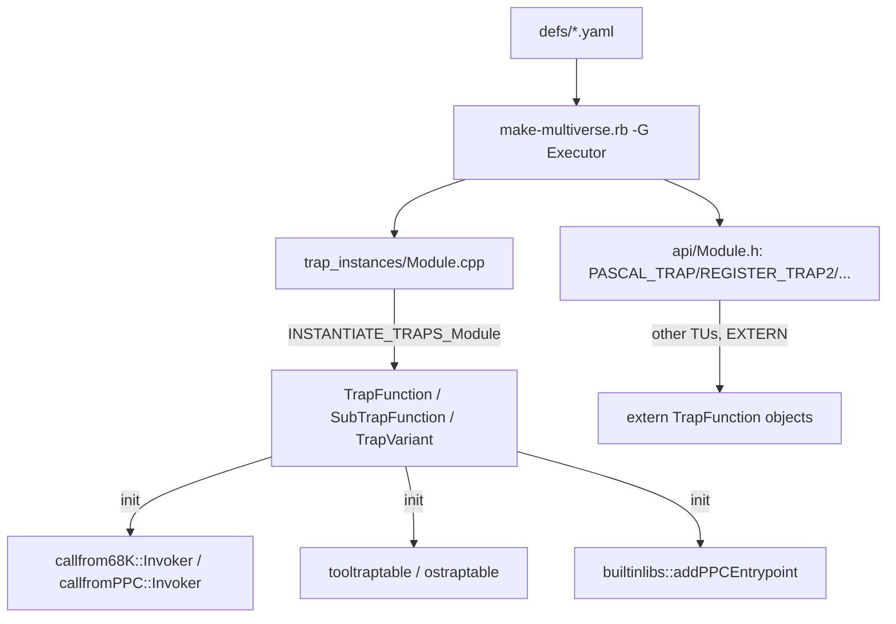
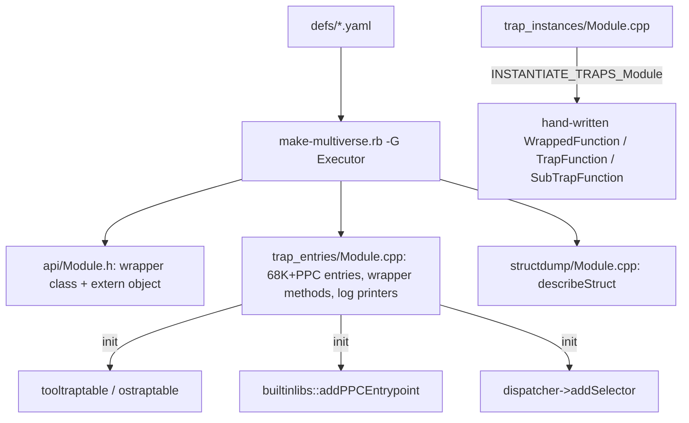

# Generated trap entrypoints (68K + PowerPC) and data-driven logging

> Date: 2026-10-07
> Status: done (all phases landed on branch `compiletime`)

## Progress

Every trap in `multiversal/defs/*.yaml` is now a straight-line generated
entrypoint; the old `TrapFunction` / `WrappedFunction` / `SubTrapFunction` /
`TrapVariant` / `DispatcherTrap` template machinery is gone from generated code,
and `--logtraps` is data-driven.  `EXECUTOR_ENABLE_LOGGING` has been removed —
logging is runtime-only.

Headline numbers (`ninja clean && time ninja` in `build/`, Debug, 24 cores, all
front-ends + tests; `executor` = `build/executor`):

| phase | wall | user | executor debug | executor stripped | libromlib.a |
|---|---|---|---|---|---|
| **start** (logging ON) | 1m04.3s | 12m34.5s | 242,503,464 | 28,112,904 | 418,003,096 |
| logging single-instantiation | 0m51.7s | 816s CPU | 171.4 MB | 19.3 MB | 294 MB |
| Phase 1 — Pascal traps | 0m51.7s | | 148.0 MB | 16.8 MB | 254 MB |
| Phase 2a–2e / 4a — Register, file, dispatch | 0m46.4s | 10m43.3s | 90.8 MB | 11.5 MB | 167.7 MB |
| 4a-4 — remaining traps + HFS_SUBTRAP | 0m47.7s | 10m46.7s | 89,904,744 | 11,433,960 | 166,386,180 |
| 4a-5 — generated dispatchers | 0m48.0s | 10m45.8s | 88,832,272 | 11,413,480 | 162,098,390 |
| 2g/4c — NOTRAP_FUNCTION | 0m47.1s | 10m38.8s | 70,854,320 | 9,828,328 | 129,608,614 |
| 4b — dead machinery deleted | 0m47.5s | 10m40.6s | 70,853,528 | 9,828,328 | 129,607,286 |
| L3 — data-driven logging | 0m47.5s | 10m35.8s | 69,697,168 | 9,746,408 | 126,460,662 |
| **flag removed** (runtime-only) | 0m47.5s | 10m36.2s | 69,696,760 | 9,746,408 | 126,459,446 |

Net: wall **−26%**, `executor` debug **−71%**, stripped **−65%**, `libromlib.a`
**−70%**.  Logging-ON and logging-OFF now differ by ~0.15 s wall and ~0.1 MB
stripped, which is why the build option was dropped.

The comparison build was a clean rebuild that must be understood in terms of
*total serial work*, not the critical path: after the generated-trap work the
heaviest translation units are ordinary hand-written ones (`front-end-qt`
`qtkeycodes.cpp` ~6.7 s, `init.cpp` ~6.5 s, five `main.cpp` ~6 s, `prPrinting.cpp`
~5.6 s), and the generated `trap_entries/*.cpp` are around 5 s each.  That shift is
recorded separately in `docs/ai/2026-10-07-ordinary-tu-compile-time-notes.md`.

What landed (each commit builds all front-ends and passes the suites):

1. **Phase 0** — generator infrastructure; `GeneratedEntrypoint` skeleton.
2. **Logging single-instantiation** — `LoggedFunction` gates on
   `logging::enabled()`, so one instantiation serves logged and unlogged.
3. **Phase 1** — the 566 Pascal traps become generated wrapper objects.
4. **Phase 2a–2e, 4a-1..4a-3** — Register traps (plain, `Out`/`InOut`, extras,
   flag variants), file traps (`FILE_TRAP`/`HFS_TRAP`/`*_SUBTRAP`), and
   dispatcher sub-traps (`PASCAL_SUBTRAP`, `REGISTER_SUBTRAP*`, `FILE_SUBTRAP`).
5. **4a-4** — the last fallbacks: `void()` Register traps (`ADBReInit`),
   `D0Minus1Boolean` (`GetOSEvent`/`OSEventAvail`), multi-extra Register traps
   (`HandToHand` et al.) and `HFS_SUBTRAP` (`PBHOpenDF`).
6. **4a-5** — `DISPATCHER_TRAP`/`EXTERN_DISPATCHER_TRAP` become
   `GeneratedDispatcherTrap` objects (selector convention as data).
7. **2g/4c** — the 546 `NOTRAP_FUNCTION*` (low-memory accessors `LMGet*`/
   `LMSet*`, `FSOpen`/`HOpen`/…, `SwapMMUMode`, …) become generated entries with
   trap number 0.  Biggest single size win.
8. **4b** — delete `TrapVariant`, `DispatcherTrap`, `selectors::*` and the
   now-unused macros; the generator `raise`s for any trap shape it cannot convert.
9. **L3** — data-driven `--logtraps` (per-type printers + a non-template
   formatter).
10. **Flag removal** — delete `EXECUTOR_ENABLE_LOGGING` and its `#ifdef`s.

See [Sub-steps](#sub-steps) for the full outline that was reviewed, and
[Baseline to beat](#baseline-to-beat) for the raw numbers.

### Superseded earlier notes

- **Phase 0** also added an off-by-default `EXECUTOR_GENERATED_ENTRYPOINTS`
  option; the generated entrypoints are now unconditional and that option is gone.
- **Phase 1** originally measured 148.0 MB / 16.8 MB (logging ON).

## Goal

Move the per-trap "glue" from C++ template instantiation into code emitted by
`multiversal`, so that compiling the generated trap translation units no longer
forces the compiler through the `TrapFunction` / `WrappedFunction` /
`callfrom68K::Invoker` / `callfromPPC::Invoker` / `Register<...>` template
machinery once per trap.

Concretely, the generator would emit, per trap:

1. a straight-line 68K entrypoint (`syn68k_addr_t (syn68k_addr_t addr)`) that
   reads its arguments from the registers/stack according to the trap's calling
   convention, calls `C_<Trap>`, writes the results back and returns the guest
   return address;
2. a straight-line PowerPC entrypoint (`uint32_t (PowerCore&)`) doing the same
   against the PPC register/stack ABI;
3. a small registration object that installs both and populates
   `tooltraptable`/`ostraptable`.

The template layer then shrinks to runtime infrastructure shared by all traps
(registration, trap-table patching, breakpoints, `UPP` calls into the guest).

Logging is treated separately, as three shippable iterations (see
[Logging](#logging)).

## Constraints (from review)

These are hard requirements, not preferences:

- **No build-configuration shortcuts.** Do not propose `-g0` on generated code,
  headless-only builds, or building/testing only part of the tree. Compile-time
  wins must not come from dropping code, debug info, or front-ends.
- **`--logtraps` must keep working** in logging-enabled builds, with equivalent
  output.
- **No regressions** in trap patching (`GetTrapAddress`/`SetTrapAddress`),
  debugger breakpoints (`Entrypoint::breakpoint`, cxmon `atc`), or the
  hand-written `UPP` / `*_FUNCTION_PTR` / `RAW_68K_*` call sites.
- **Binary size is a first-class metric.** Every phase records debug-info and
  stripped binary sizes, not just wall/CPU time.
- **Subsystem docs change with their subsystem.** `docs/subsystems/*.md` is
  updated in the same change that alters the subsystem it describes, not in
  advance of it.

## Why (measurements)

From `build/.ninja_log` (unique outputs) on the current Debug + logging build:

| group | serial time | TUs |
|---|---|---|
| all `.o` | 1040 s | 489 |
| generated `trap_instances/*.cpp.o` | 377 s (36%) | 66 |
| generated `structdump/*.cpp.o` | 82 s (8%) | 66 |

Heaviest TUs: `FileMgr` 27 s, `CQuickDraw` 25 s, `QuickDraw` 24 s,
`MemoryMgr` 17 s.

- 1346 trap declarations in the generated headers expand to ~2000+ explicit
  class-template instantiations. These are **per trap**, not per signature:
  the implementation function pointer is a non-type template argument, so there
  is no sharing. `FileMgr.cpp` alone has **249** (124 `TrapVariant`, 54
  `WrappedFunction`, 41 `SubTrapFunction`, 30 `TrapFunction`).
- `-ftime-report` on `FileMgr.cpp` (21.3 s): template instantiation 4.3 s (20%),
  overload resolution + name lookup 3.5 s (16%), and the bulk is codegen of the
  resulting bodies. Parsing/preprocessing is not the problem.
- Clean-rebuild benchmark (`cmake -B build -DEXECUTOR_ENABLE_LOGGING={ON,OFF};
  ninja -C build clean; cd build && time ninja`, 24 cores, all front-ends +
  tests):

  | config | real | user | sys |
  |---|---|---|---|
  | logging ON | 1m04.3s | 12m34.5s | 2m57.8s |
  | logging OFF | 0m49.8s | 10m33.3s | 2m41.6s |

  Logging costs ~15 s wall and ~135 s CPU. On `FileMgr.cpp` the per-TU ratio is
  21.3 s → 12.2 s (1.75×), so essentially the whole logging delta is the
  compile-time duplication of the logged/unlogged path in the trap TUs. It is
  also the dominant **binary-size** delta: the `executor` binary is 242.5 MB
  debug / 28.1 MB stripped with logging, versus 161.9 MB / 18.0 MB without —
  see [Baseline to beat](#baseline-to-beat).

This plan targets the 36% that lives in the generated trap TUs, and removes the
compile-time logging duplication as a side effect.

## Data flow

**Before** (the shape this plan replaced):



**After** (what landed):



Relevant hand-written machinery: `src/base/traps.h`, `src/base/traps.impl.h`,
`src/base/functions.h`, `src/base/functions.impl.h`, `src/base/traps.cpp`,
`src/base/dispatcher.cpp`, `src/base/builtinlibs.{h,cpp}`.

## Which machinery is hand-written code allowed to touch

Established by inspecting every non-generated reference (see the analysis in the
review thread). A generate-everything refactor **must keep**:

- `UPP<Ret(Args...), CC>` and `ProcPtr` — used as a value type in ~50
  hand-written files; `upp(args...)` marshal into the guest.
- `WrappedFunction` + the `*_FUNCTION_PTR` macros, because hand-written code
  publishes its own C++ functions as guest callables:
  `PASCAL_FUNCTION_PTR` (adb, ctlArrows, dialHandle, dialInit, gestalt, init
  ×10, listMouse, osutil, prLowLevel, prPrinting ×25, soundIMVI, stdfile,
  teInsert, vbl, toolevent, refresh), `REGISTER_FUNCTION_PTR` (mactcp ×7,
  serial ×5, using `D0(A0,A1)`), `CCALL_FUNCTION_PTR` (mpw ×6),
  `EXTERN_PASCAL_FUNCTION_PTR` (dial.h, tesave.h).
- `TrapFunction` for `RAW_68K_TRAP`/`RAW_68K_FUNCTION`/`RAW_68K_IMPLEMENTATION`
  (`base/emustubs.h` ~29 + `emustubs.cpp`, `traps.cpp`, `patches.cpp`,
  `pack.cpp`), i.e. the `callconv::Raw` path.
- `callconv::Register<...>` + `D<n>`/`A<n>` for `REGISTER_FUNCTION_PTR`.
- `Entrypoint` / `entrypoints` / `DeferredInit` for startup and the debugger
  (`base/debugger.cpp`, `debug/mon_debugger.cpp`, `main.cpp`).
- `tooltraptable` / `ostraptable` and `stub_*` for `base/patches.cpp`.

Everything else is reachable **only** from generated code and was replaced:
`TrapVariant`, `DispatcherTrap`, the `selectors::*` DSL and the macros only
generated code expanded.  **Correction (after landing):** the `Out`/`InOut`/
`TrapBit`/`D0HighWord`/`D0LowWord`/`ClearD0`/descriptor set and the
`callfrom68K`/`callfromPPC` invokers **stayed** — the generated Register entries
use the descriptors as types (`callconv::TrapBit<ASYNCBIT> c0;`), and
`WrappedFunction::init()` still uses the invokers for the hand-written
`*_FUNCTION_PTR` sites.  `SubTrapFunction` also stayed, for `GetFrontProcess`.
Only `TrapVariant`, `DispatcherTrap`, `selectors::*` and the genuinely dead macros
were deleted (see [Sub-steps](#sub-steps)).

## Design

### New runtime layer (hand-written, non-template)

Add `src/base/trap-entry.{h,cpp}` with the non-template pieces shared by all
generated entrypoints:

- `using Entry68KFn = syn68k_addr_t (*)(syn68k_addr_t);`
- `using EntryPPCFn = uint32_t (*)(PowerCore&);`
- `syn68k_addr_t traps::install68KCallback(Entry68KFn, void* ctx);` — the
  current `traps::callback_install` body (`currentCPUMode`, `currentM68KPC`)
  specialised to a plain function pointer instead of a per-trap functor.
- A non-template `GeneratedEntrypoint : Entrypoint` holding
  `Entry68KFn`, `EntryPPCFn`, `trapno`, and `originalFunction`; its `init()`
  installs the 68K callback, registers the PPC entry via
  `builtinlibs::addPPCEntrypoint`, and fills the trap table. It also provides
  the patch check (`isPatched()` / `invokeViaTrapTable` semantics) that
  `TrapFunction::operator()` has today.
- The argument helpers the generated code needs, expressed without templates
  where possible: guarded register/stack reads (`EM_D0`, `cpu_state.regs[n]`,
  `callconv::stack::pop<syn68k_addr_t>()`), plus the `GUEST<T>` conversions
  (`toRawHostOrder` / `setRawHostOrder`) already used by the descriptors.

The per-trap *callable object* (the public `PBRead(...)` / `&PBRead` name) is
**generated** as a thin class deriving from `GeneratedEntrypoint`: it carries
the typed `operator()` (direct call, or via the trap table if patched) and
`operator&` returning the typed `UPP`, and its `init()` is generated. This
preserves the exact source-level behaviour hand-written code relies on, without
instantiating `TrapFunction`/`WrappedFunction`.

### What the generator emits

For each function in each module, `ExecutorGenerator` already computes the
return/argument types and the calling convention. It would additionally emit,
into a (new) generated `trap_entries/<Module>.cpp` (replacing
`trap_instances/<Module>.cpp`):

**68K, Pascal** (args right-to-left on stack, return above the return address):

```cpp
// OSErr GetFInfo(ConstStringPtr filen, INTEGER vrn, FInfo *fndrinfo); PASCAL_TRAP(...,0xA00C)
static syn68k_addr_t entry_GetFInfo(syn68k_addr_t addr)
{
    syn68k_addr_t retaddr = callconv::stack::pop<syn68k_addr_t>();
    FInfo *fndrinfo          = callconv::stack::pop<FInfo*>();
    INTEGER vrn              = callconv::stack::pop<INTEGER>();
    ConstStringPtr filen     = callconv::stack::pop<ConstStringPtr>();
    OSErr ret = C_GetFInfo(filen, vrn, fndrinfo);
    *ptr_from_longint<GUEST<OSErr>*>(EM_A7) = ret;   // return on stack
    return retaddr;
}
```

**68K, Register** (register/stack operand list, `POPADDR` first):

```cpp
// OSErr PBRead(ParmBlkPtr pb, Boolean async);
//   FILE_TRAP -> Register<D0(A0, TrapBit<ASYNCBIT>)>
static syn68k_addr_t entry_PBRead(syn68k_addr_t addr)
{
    syn68k_addr_t retaddr = POPADDR();
    ParmBlkPtr pb = ptr_from_longint<ParmBlkPtr>(EM_A0);
    bool async    = !!(EM_D1 & (1 << 10));
    OSErr ret = C_PBRead(pb, async);
    EM_D0 = ret;
    return retaddr;
}
```

The register descriptors become explicit code:

| descriptor | generated 68K code |
|---|---|
| `D<n>` read | `cpu_state.regs[n].ul.n` |
| `D<n>`/`A<n>` set | `cpu_state.regs[n].ul.n = ...` |
| `TrapBit<mask>` read | `!!(EM_D1 & mask)` |
| `D0HighWord`/`D0LowWord` | shifts/masks of `EM_D0` |
| `Out<T,loc>` | local `GUEST<T> tmp; ... read via tmp; loc::set(toRawHostOrder(tmp))` after the call |
| `InOut<T,in,out>` | initialise from `in`, write back to `out` |
| `ClearD0`, `CCFromD0`, `SaveA1D1D2`, `MoveA1ToA0` | inline save/afterwards code emitted around the call |

**PowerPC** (mirrors `callfromPPC::Invoker` / `ParameterPasser`: GPRs `r3..r10`,
FPRs `f1..`, stack at `cpu.r[1] + 24`, return in `r3`):

```cpp
static uint32_t entry_PBRead_ppc(PowerCore& cpu)
{
    uint32_t saveLR = cpu.lr;
    EM_A7 = cpu.r[1];
    ParmBlkPtr pb = guestvalues::GuestTypeTraits<ParmBlkPtr>::reg_to_host(cpu.r[3]);
    bool async    = guestvalues::GuestTypeTraits<bool>::reg_to_host(cpu.r[4]);
    OSErr ret = C_PBRead(pb, async);
    cpu.r[3] = guestvalues::GuestTypeTraits<OSErr>::host_to_reg(ret);
    cpu.r[1] = EM_A7;
    return saveLR;
}
```

**Registration** (generated, per module, called from `traps::init()`):

```cpp
GeneratedEntrypoint entry_GetFInfo_obj {
    "GetFInfo", "InterfaceLib", 0xA00C, &entry_GetFInfo, /*ppc*/ nullptr };
// entry_GetFInfo_obj is in the DeferredInit list -> init() at startup
```

**Dispatch traps** (`DISPATCHER_TRAP`, e.g. `_OSDispatch`): generate the
selector read and a concrete lookup. Keep the runtime `std::unordered_map`
initially (it is tiny); a later iteration can emit a static sorted table +
binary search. `DispatcherTrap<selectors::D0>` and `selectors::*` then disappear.

**Variants** (`FILE_TRAP`/`HFS_TRAP` produce Sync/Async × MFS/HFS): generate one
shared marshaller parameterised by runtime booleans, plus four tiny registration
entries for the four exported names (`PBReadSync`, `PBReadAsync`, …). This
removes ~300 `TrapVariant` instantiations and collisions with the earlier
"collapse flags to runtime" idea.

### Compatibility shims

- `WrappedFunction` and the `*_FUNCTION_PTR` macros stay hand-written and
  unchanged; they continue to use `callfrom68K::Invoker` / `callfromPPC::Invoker`
  for their few dozen instantiations. Only the generated code stops using them.
- `TrapFunction` (or a slimmed equivalent) stays for `RAW_68K_*` in
  `emustubs.h` and `traps.cpp`.
- `UPP`, `Entrypoint`, `entrypoints`, `DeferredInit`, the trap tables and
  `stub_*` all stay.

## Logging

Three variants, in increasing order of payoff and scope. Each is independently
shippable and measurable, and later variants supersede earlier ones.

**L1 — reuse the existing templated logging.** The generated entrypoint decides
at runtime whether logging is on and, if so, invokes the implementation through
`logging::makeLoggedFunction<CC>(name, C_Foo)` instead of `C_Foo` directly; the
rest of the path is the existing `LoggedFunction`. Leaves `LoggedFunction` and
the variadic `logList` templates in place. Smallest diff; mainly proves the
generated entrypoints wire up correctly.

**L2 — drop `LoggedFunction`.** The generated entrypoint already has the typed
argument values, so it calls the "log arguments"/"log return" templates
directly around the implementation call:

```cpp
if(loggingWanted(name))            // logging::trapLogEnabled + nesting gate
    logTrapCall(name, pb, async);
OSErr ret = C_PBRead(pb, async);
if(loggingWanted(name))
    logTrapValReturn(name, ret, pb, async);
```

Delete `LoggedFunction`, `makeLoggedFunction`, `makeLoggedFunction1`. This
removes the second functor-type instantiation per trap (the main reason logging
roughly doubles those TUs). Instantiates `logTrapCall`/`logTrapValReturn` once
per *signature* instead of once per trap, and no longer at all for the
non-logging path.

**L3 — data-driven logging — done.** The generated entrypoints emit one printer
per distinct argument/return type per module (calling `logging::logValue`), a small
per-trap `static const logging::LogArgFn` table, and a single non-template call to
`logging::logTrapCallData` / `logTrapValReturnData` / `logTrapVoidReturnData`.  This
removes all per-trap logging template instantiation (`logList`/`logValue` were
already per-type).  It does **not** reuse `structdump::TypeDesc` for the argument
*locations* — the entrypoints already hold the typed values, so only the printers
had to be shared.  The data-driven form is verified by diffing the structure of a
`--logtraps` run against the pre-L3 binary.

**`EXECUTOR_ENABLE_LOGGING` is removed — done.** The build option existed only
because the templated logging feature doubled trap compile time and binary size; it
was never desirable in its own right.  Logging is now a purely runtime feature:
the `#ifdef EXECUTOR_ENABLE_LOGGING` guards and the CMake option are deleted, and
`--logtraps` is always available.  After L3 a logging-enabled build costs ~0.15 s
wall and ~0.1 MB stripped over a logging-disabled one, which is why dropping the
flag costs nothing.

## Phases

Each phase built all front-ends, ran the full test suites, and was benchmarked with
`ninja clean && time ninja` (sizes too).  Everything below is **done**; the ordered
list of sub-steps is in [Sub-steps](#sub-steps).

### Landed

- **Phase 0 — infrastructure.** `multiversal` emits straight-line 68K Pascal
  entrypoints into `trap_entries/`; `src/base/trap-entry.{h,cpp}` holds the
  `GeneratedEntrypoint` skeleton. No behaviour change.
- **Phase 1 — Pascal traps (68K + PPC).** Pascal traps use generated
  `Wrapper_<Trap>` objects deriving from `GeneratedEntrypoint`, with straight-line
  68K/PPC entrypoints; the header declares the class + `extern` object instead of
  `PASCAL_TRAP`.
- **Logging single-instantiation** (precursor to L2).

## Sub-steps

This is the outline that was reviewed before implementation.  Every sub-step was
required to build all front-ends, run `ctest -LE xfail` and the Retro68 Mac suite,
be benchmarked with `ninja clean && time ninja` (plus sizes), and be committed
separately.  All are **done**.

Same shape as Phase 1 throughout: for each trap the generator emits a
`Wrapper_<Trap>` class (declared in the module header) plus straight-line 68K and
PowerPC entrypoints, registration, and logging in `trap_entries/<Module>.cpp`. The
PowerPC entry is **convention-independent** (it only needs the implementation's
argument types, via `callfromPPC::ParameterPasser`), so every sub-step emits PPC
too and the old separate "Phase 3" collapsed into them. All descriptor/extra
*behaviour* stayed in the existing hand-written classes; generated code only
constructs them and reproduces the template unrolling below.

**Unrolling order reproduced** by the generated 68K Register entry (from
`callfrom68K::Invoker` + `RegInvoker`):

1. construct the extras outermost-first (`Extra1`, `Extra2`, …);
2. `retaddr = POPADDR()`;
3. construct each argument descriptor (`CC0`, `CC1`, …) and materialise the host
   argument values (the descriptor→parameter conversions);
4. log the incoming arguments;
5. call the implementation; log the return value;
6. unless the return convention is `void`, `RetConv::set(retval)`;
7. `r = retaddr`, then run the extras' `afterwards` innermost-first
   (`r = ExtraN.afterwards(r) … r = Extra1.afterwards(r)`);
8. `return r`.

- **2a — done.** Plain Register traps: arg descriptors
  `D<n>`/`A<n>`/`TrapBit<mask>`/`D0HighWord`/`D0LowWord`; return conventions
  `D<n>`/`A<n>`/`void`. Object/impl naming followed the macro exactly:
  `REGISTER_TRAP` (name == cname) defines object `NAME` wrapping `C_NAME`;
  `REGISTER_TRAP2` defines object `stub_NAME` wrapping `NAME`.
- **2b — done.** `Out<T,loc>` / `InOut<T,loc,outloc>` argument descriptors.
- **2c — done.** Extras: `ReturnMemErr<D0>`, `ReturnMemErrConditional<D0>`,
  `SaveA1D1D2`, `ClearD0`, `CCFromD0`, `MoveA1ToA0`.
- **2d — done.** Flag traps and variants (`REGISTER_FLAG_TRAP`,
  `REGISTER_2FLAG_TRAP`): the `stub_<impl>` object plus one generated adapter per
  exported name, forwarding with its flag arguments bound and registering a PPC
  name only.
- **2e — done.** File traps: `FILE_TRAP`/`FILE_SUBTRAP`/`HFS_TRAP`, including the
  `PBH*`→`PB*` rename, the `trap & 0xA0FF` masking and the `ASYNCBIT`/`HFSBIT`
  `TrapBit`s.
- **4a-1 — done.** `PASCAL_SUBTRAP`.
- **4a-2/4a-3 — done.** `REGISTER_SUBTRAP*` and `FILE_SUBTRAP`.
- **4a-4 — done.** The last non-dispatcher fallbacks: `void()` Register traps
  (`ADBReInit`), the `D0Minus1Boolean` return convention (`GetOSEvent`,
  `OSEventAvail`), Register traps with several extras (`HandToHand`, `PtrToHand`,
  `PtrToXHand`, `HandAndHand`, `PtrAndHand`) and `HFS_SUBTRAP` (`PBHOpenDF`).
- **4a-5 — done.** The dispatchers themselves: `DISPATCHER_TRAP`/`
  EXTERN_DISPATCHER_TRAP` become one non-template `GeneratedDispatcherTrap`
  object per dispatcher, with the selector convention as data.
- **2g/4c — done.** The 546 `NOTRAP_FUNCTION*` (low-memory accessors, `FSOpen` /
  `HOpen` / `TE*Scrap*` / `Ser*`, `SwapMMUMode`, …) become generated entries with
  trap number 0.
- **4b — done.** Delete dead machinery and fail loudly for unconvertible shapes.
- **L3 — done.** Data-driven `--logtraps`.
- **Flag removal — done.** `EXECUTOR_ENABLE_LOGGING` deleted.

**What 4b actually deleted.** `TrapVariant`, `DispatcherTrap`, the `selectors::*`
DSL, `LOWMEM_ACCESSOR`, `TRAP_VARIANT`/`REGISTER_FLAG_TRAP`/`REGISTER_2FLAG_TRAP`,
`FILE_*TRAP`/`HFS_*TRAP`, `REGISTER_SUBTRAP*` and `DISPATCHER_TRAP`.  `SubTrapFunction`,
`TrapFunction`, `WrappedFunction`, the `callconv` descriptors and the
`callfrom68K`/`callfromPPC` invokers **stay**: hand-written code still uses them
via `*_FUNCTION_PTR`, `RAW_68K_*` and the verbatim YAML blocks (`NOTRAP_FUNCTION2`
for `GetGrayRgn`, `PASCAL_SUBTRAP` for `GetFrontProcess`).  The generator now
`raise`s for any trap shape it cannot convert instead of silently falling back.

**Risks carried by this scope.** The unrolling is mechanical but
silent-failure-prone — a mis-ordered `afterwards` or an `Out` write-back bug
corrupts guest memory rather than failing a build.  Mitigation was the native
suite (`FileTest`, `MemoryMgr`, `quickdraw`, which do cover these traps), the
Retro68 Mac suite, a `--logtraps` structure diff, and — importantly — **real Mac
applications** (see the note under [Risks and open questions](#risks-and-open-questions)).
Each sub-step left the old path intact for the traps it had not yet converted, so
a regression stayed bisectable.

## Validation

What was actually run at every sub-step, plus the extra checks:

- `ctest --test-dir build -LE xfail` — **138/138**.
- Retro68 Mac suite: `cmake --build tests/build &&
  build/executor --headless tests/build/tests.ad; cat tests/build/out` —
  **90 passed + 2 known `xfail`s** (`FileTest.SetFInfo_CrDat`,
  `FileTest.SetFLock`).
- **Real Mac applications and a real System boot**, headless.  This is the
  strongest check on the dispatchers and `NOTRAP_FUNCTION` entries: `ResEdit` and
  `ClarisWorks 3.0` run for tens of seconds with no aborts, assertions or
  `Unknown selector` messages, exercising generated `FSDispatch` subtraps
  (`PBHCreate`, `PBHOpenRF`, `PBHGetFInfo`, `PBGetWDInfo`, `FSMakeFSSpec`),
  `ResourceDispatch`, the `Pack8` AppleEvents dispatcher and the D0 flag traps.
  Local paths are deliberately not recorded here.
- **`--logtraps` equivalence**: the Mac suite run under `--logtraps` produces a
  ~2890-line log whose trap-name/structure sequence is identical before and after
  (only guest uninitialised-memory values differ).  `ROMlib_vcatch` moves between
  runs; it is filtered out for the comparison.
- Reported by the suites: patching (`FileTest` drives `PBHGetFInfo` etc.), the
  debugger registry, and the `REGISTER_FUNCTION_PTR(..., D0(A0,A1))` path in
  `mactcp.cpp`/`serial.cpp`.
- **Compile-time and size**: `ninja clean && time ninja` plus `stat`/`strip`
  after every sub-step (see [Progress](#progress)); the logtraps-ON/OFF delta now
  measures ~0.15 s wall / ~0.1 MB stripped.

## Files

| File | Role |
|---|---|
| `multiversal/executor.rb` | emit 68K/PPC entrypoints, wrapper classes, dispatcher objects, logging printers |
| `src/base/trap-entry.{h,cpp}` | `GeneratedEntrypoint` and `GeneratedDispatcherTrap` |
| `src/base/traps.h`, `src/base/traps.impl.h` | shrunk to the runtime infra plus hand-written uses (`WrappedFunction`/`TrapFunction`/`SubTrapFunction`, `UPP`, `Raw`) |
| `src/base/functions.h`, `src/base/functions.impl.h` | still hold the `callconv` descriptors and invokers used by `*_FUNCTION_PTR` |
| `src/base/logging.{h,cpp}` | runtime gate, filter, and the data-driven `logTrap*Data` formatter |
| `src/CMakeLists.txt` | generated `trap_entries`/`structdump` sources |
| `CMakeLists.txt` | `EXECUTOR_ENABLE_LOGGING` removed |
| `docs/subsystems/trap-dispatch.md` | rewritten for the generated-entrypoint model |
| `docs/architecture.md`, `README.md`, `AGENTS.md`, `.agents/skills/executor-guest-debugging/SKILL.md` | build-option references removed |

## Risks and open questions

- **ABI fidelity.** The 68K/PPC marshalling semantics (stack parity, Pascal
  return placement, `Out`/`InOut`, the `Register` extras, OS-trap register setup
  done by `alinehandler`) are subtle and load-bearing. Mitigation: one convention
  per sub-step, `--logtraps` diffs, the test suites, and real applications.
- **How validation was initially understated.** An earlier draft of this document
  said "real Mac apps can't be run here".  That was an unverified assumption of
  mine, not a property of Executor: GUI front-ends need a window server, but the
  *headless* front-end runs real Mac software fine in an ordinary sandbox, both
  single applications and a full System boot.  The assumption was corrected once
  real disk contents were available, and the dispatcher/`NOTRAP_FUNCTION`
  sub-steps were validated against real applications as a result.  (The specific
  local paths are not recorded in this repository.)
- **PPC parameter passing.** `ParameterPasser` mixes GPR/FPR/stack by position
  and type; the generated entry reproduces it exactly, including
  `sizeof(GUEST<T>) <= 4` for register-passed scalars.
- **Namespace and names.** Generated objects keep the `Executor::<Trap>` /
  `Executor::stub_<Trap>` names hand-written code expects, and `&Trap` still
  yields a typed `UPP`.
- **Debugger registry.** `entrypoints[name]` stays populated for `atc`/`atd`;
  `GeneratedEntrypoint::init()` calls `Entrypoint::init()`.
- **Generator determinism.** Output is byte-stable so incremental builds stay
  effective.
- **Alarm over `structdump`.** L3 didn't need the type registry: the entrypoints
  already hold typed values, so only the printers are shared.  `structdump` stays
  a separate generated directory.
- **Unreachable shape = generator error.** The generator now raises for any trap
  shape it cannot convert; a future YAML construct that needs a new shape will
  fail the build loudly rather than falling back.

## Not in scope

- `UPP` call-through (`callto68K::Invoker`) for hand-written `*_FUNCTION_PTR`
  users — left as is.
- `TWENTYFOUR` (`-DTWENTYFOUR=YES`) specifics beyond keeping the code compiling.
- Any change to the YAML schema; the generator already has all needed
  information.

## Baseline to beat

Measured 2026-10-07 on this machine (24 cores) with the full
`ninja clean && ninja` (all front-ends + tests), `CMAKE_BUILD_TYPE=Debug`.
Sizes are bytes; the "stripped" columns are the same binaries after `strip`.
`executor` is the default (qt) front-end; the other front-ends are within a few
hundred KB of it. Regenerate with:

```
ninja -C build clean && time ninja -C build
stat -c '%s %n' build/executor build/tests/tests build/src/libromlib.a
strip -o /tmp/ex.stripped build/executor && stat -c '%s %n' /tmp/ex.stripped
strip -o /tmp/tests.stripped build/tests/tests && stat -c '%s %n' /tmp/tests.stripped
```

**Before** (logging had to be enabled to get `--logtraps`, and that cost):

| config | real | user | sys | `executor` debug | `executor` stripped | `tests` debug | `tests` stripped | `libromlib.a` |
|---|---|---|---|---|---|---|---|---|
| logging ON | 1m04.3s | 12m34.5s | 2m57.8s | 242,503,464 | 28,112,904 | 244,358,336 | 28,459,568 | 418,003,096 |
| logging OFF | 0m49.8s | 10m33.3s | 2m41.6s | 161,867,640 | 17,983,496 | 163,718,744 | 18,326,064 | 275,318,268 |

**After** (logging always available, no build flag):

| config | real | user | sys | `executor` debug | `executor` stripped | `tests` debug | `tests` stripped | `libromlib.a` |
|---|---|---|---|---|---|---|---|---|
| no flag | 0m47.5s | 10m36.2s | 2m50.0s | 69,696,760 | 9,746,408 | 71,495,336 | 10,089,008 | 126,459,446 |

The old target was "the logging-OFF build time and sizes while keeping logging
available".  That is met and then some: the single configuration is now smaller
and faster than the old logging-OFF build while `--logtraps` always works.

Known-failing, unchanged: the two `xfail` `FileTest` cases.
