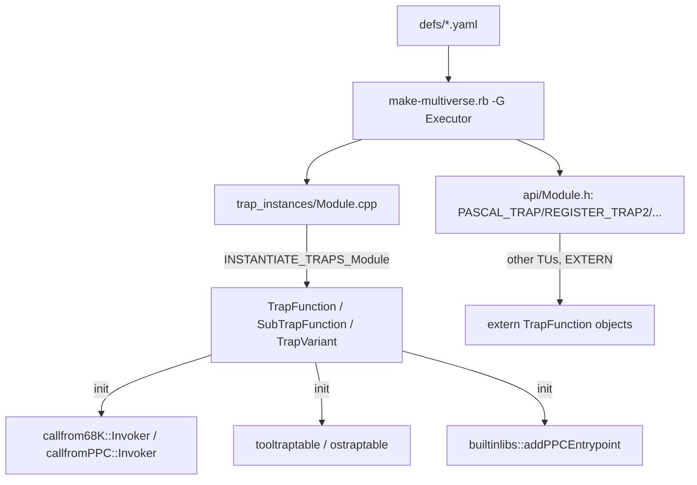

# Generated trap entrypoints (68K + PowerPC) and data-driven logging

> Date: 2026-10-07
> Status: proposed (no code written yet)

## Goal

Move the per-trap "glue" from C++ template instantiation into code emitted by
`multiversal`, so that compiling the generated trap translation units no longer
forces the compiler through the `TrapFunction` / `WrappedFunction` /
`callfrom68K::Invoker` / `callfromPPC::Invoker` / `Register<...>` template
machinery once per trap.

Concretely, the generator would emit, per trap:

1. a straight-line 68K entrypoint (`syn68k_addr_t (syn68k_addr_t addr)`) that
   reads its arguments from the registers/stack according to the trap's calling
   convention, calls `C_<Trap>`, writes the results back and returns the guest
   return address;
2. a straight-line PowerPC entrypoint (`uint32_t (PowerCore&)`) doing the same
   against the PPC register/stack ABI;
3. a small registration object that installs both and populates
   `tooltraptable`/`ostraptable`.

The template layer then shrinks to runtime infrastructure shared by all traps
(registration, trap-table patching, breakpoints, `UPP` calls into the guest).

Logging is treated separately, as three shippable iterations (see
[Logging](#logging)).

## Constraints (from review)

These are hard requirements, not preferences:

- **No build-configuration shortcuts.** Do not propose `-g0` on generated code,
  headless-only builds, or building/testing only part of the tree. Compile-time
  wins must not come from dropping code, debug info, or front-ends.
- **`--logtraps` must keep working** in logging-enabled builds, with equivalent
  output.
- **No regressions** in trap patching (`GetTrapAddress`/`SetTrapAddress`),
  debugger breakpoints (`Entrypoint::breakpoint`, cxmon `atc`), or the
  hand-written `UPP` / `*_FUNCTION_PTR` / `RAW_68K_*` call sites.
- **Binary size is a first-class metric.** Every phase records debug-info and
  stripped binary sizes, not just wall/CPU time.
- **Subsystem docs change with their subsystem.** `docs/subsystems/*.md` is
  updated in the same change that alters the subsystem it describes, not in
  advance of it.

## Why (measurements)

From `build/.ninja_log` (unique outputs) on the current Debug + logging build:

| group | serial time | TUs |
|---|---|---|
| all `.o` | 1040 s | 489 |
| generated `trap_instances/*.cpp.o` | 377 s (36%) | 66 |
| generated `structdump/*.cpp.o` | 82 s (8%) | 66 |

Heaviest TUs: `FileMgr` 27 s, `CQuickDraw` 25 s, `QuickDraw` 24 s,
`MemoryMgr` 17 s.

- 1346 trap declarations in the generated headers expand to ~2000+ explicit
  class-template instantiations. These are **per trap**, not per signature:
  the implementation function pointer is a non-type template argument, so there
  is no sharing. `FileMgr.cpp` alone has **249** (124 `TrapVariant`, 54
  `WrappedFunction`, 41 `SubTrapFunction`, 30 `TrapFunction`).
- `-ftime-report` on `FileMgr.cpp` (21.3 s): template instantiation 4.3 s (20%),
  overload resolution + name lookup 3.5 s (16%), and the bulk is codegen of the
  resulting bodies. Parsing/preprocessing is not the problem.
- Clean-rebuild benchmark (`cmake -B build -DEXECUTOR_ENABLE_LOGGING={ON,OFF};
  ninja -C build clean; cd build && time ninja`, 24 cores, all front-ends +
  tests):

  | config | real | user | sys |
  |---|---|---|---|
  | logging ON | 1m04.3s | 12m34.5s | 2m57.8s |
  | logging OFF | 0m49.8s | 10m33.3s | 2m41.6s |

  Logging costs ~15 s wall and ~135 s CPU. On `FileMgr.cpp` the per-TU ratio is
  21.3 s → 12.2 s (1.75×), so essentially the whole logging delta is the
  compile-time duplication of the logged/unlogged path in the trap TUs. It is
  also the dominant **binary-size** delta: the `executor` binary is 242.5 MB
  debug / 28.1 MB stripped with logging, versus 161.9 MB / 18.0 MB without —
  see [Baseline to beat](#baseline-to-beat).

This plan targets the 36% that lives in the generated trap TUs, and removes the
compile-time logging duplication as a side effect.

## Current data flow



Relevant hand-written machinery: `src/base/traps.h`, `src/base/traps.impl.h`,
`src/base/functions.h`, `src/base/functions.impl.h`, `src/base/traps.cpp`,
`src/base/dispatcher.cpp`, `src/base/builtinlibs.{h,cpp}`.

## Which machinery is hand-written code allowed to touch

Established by inspecting every non-generated reference (see the analysis in the
review thread). A generate-everything refactor **must keep**:

- `UPP<Ret(Args...), CC>` and `ProcPtr` — used as a value type in ~50
  hand-written files; `upp(args...)` marshal into the guest.
- `WrappedFunction` + the `*_FUNCTION_PTR` macros, because hand-written code
  publishes its own C++ functions as guest callables:
  `PASCAL_FUNCTION_PTR` (adb, ctlArrows, dialHandle, dialInit, gestalt, init
  ×10, listMouse, osutil, prLowLevel, prPrinting ×25, soundIMVI, stdfile,
  teInsert, vbl, toolevent, refresh), `REGISTER_FUNCTION_PTR` (mactcp ×7,
  serial ×5, using `D0(A0,A1)`), `CCALL_FUNCTION_PTR` (mpw ×6),
  `EXTERN_PASCAL_FUNCTION_PTR` (dial.h, tesave.h).
- `TrapFunction` for `RAW_68K_TRAP`/`RAW_68K_FUNCTION`/`RAW_68K_IMPLEMENTATION`
  (`base/emustubs.h` ~29 + `emustubs.cpp`, `traps.cpp`, `patches.cpp`,
  `pack.cpp`), i.e. the `callconv::Raw` path.
- `callconv::Register<...>` + `D<n>`/`A<n>` for `REGISTER_FUNCTION_PTR`.
- `Entrypoint` / `entrypoints` / `DeferredInit` for startup and the debugger
  (`base/debugger.cpp`, `debug/mon_debugger.cpp`, `main.cpp`).
- `tooltraptable` / `ostraptable` and `stub_*` for `base/patches.cpp`.

Everything else is reachable **only** from generated code and can be replaced:
`TrapVariant`, `SubTrapFunction`, `DispatcherTrap`, `GenericDispatcherTrap`, the
`selectors::*` DSL, the `Out`/`InOut`/`TrapBit`/`D0HighWord`/`D0LowWord`/
`ClearD0`/`SaveA1D1D2`/`MoveA1ToA0`/`CCFromD0`/`ReturnMemErr` descriptor set, and
the `callfrom68K`/`callfromPPC`/`callto68K` invokers (the last one only via
`UPP::operator()`).

## Design

### New runtime layer (hand-written, non-template)

Add `src/base/trap-entry.{h,cpp}` with the non-template pieces shared by all
generated entrypoints:

- `using Entry68KFn = syn68k_addr_t (*)(syn68k_addr_t);`
- `using EntryPPCFn = uint32_t (*)(PowerCore&);`
- `syn68k_addr_t traps::install68KCallback(Entry68KFn, void* ctx);` — the
  current `traps::callback_install` body (`currentCPUMode`, `currentM68KPC`)
  specialised to a plain function pointer instead of a per-trap functor.
- A non-template `GeneratedEntrypoint : Entrypoint` holding
  `Entry68KFn`, `EntryPPCFn`, `trapno`, and `originalFunction`; its `init()`
  installs the 68K callback, registers the PPC entry via
  `builtinlibs::addPPCEntrypoint`, and fills the trap table. It also provides
  the patch check (`isPatched()` / `invokeViaTrapTable` semantics) that
  `TrapFunction::operator()` has today.
- The argument helpers the generated code needs, expressed without templates
  where possible: guarded register/stack reads (`EM_D0`, `cpu_state.regs[n]`,
  `callconv::stack::pop<syn68k_addr_t>()`), plus the `GUEST<T>` conversions
  (`toRawHostOrder` / `setRawHostOrder`) already used by the descriptors.

The per-trap *callable object* (the public `PBRead(...)` / `&PBRead` name) is
**generated** as a thin class deriving from `GeneratedEntrypoint`: it carries
the typed `operator()` (direct call, or via the trap table if patched) and
`operator&` returning the typed `UPP`, and its `init()` is generated. This
preserves the exact source-level behaviour hand-written code relies on, without
instantiating `TrapFunction`/`WrappedFunction`.

### What the generator emits

For each function in each module, `ExecutorGenerator` already computes the
return/argument types and the calling convention. It would additionally emit,
into a (new) generated `trap_entries/<Module>.cpp` (replacing
`trap_instances/<Module>.cpp`):

**68K, Pascal** (args right-to-left on stack, return above the return address):

```cpp
// OSErr GetFInfo(ConstStringPtr filen, INTEGER vrn, FInfo *fndrinfo); PASCAL_TRAP(...,0xA00C)
static syn68k_addr_t entry_GetFInfo(syn68k_addr_t addr)
{
    syn68k_addr_t retaddr = callconv::stack::pop<syn68k_addr_t>();
    FInfo *fndrinfo          = callconv::stack::pop<FInfo*>();
    INTEGER vrn              = callconv::stack::pop<INTEGER>();
    ConstStringPtr filen     = callconv::stack::pop<ConstStringPtr>();
    OSErr ret = C_GetFInfo(filen, vrn, fndrinfo);
    *ptr_from_longint<GUEST<OSErr>*>(EM_A7) = ret;   // return on stack
    return retaddr;
}
```

**68K, Register** (register/stack operand list, `POPADDR` first):

```cpp
// OSErr PBRead(ParmBlkPtr pb, Boolean async);
//   FILE_TRAP -> Register<D0(A0, TrapBit<ASYNCBIT>)>
static syn68k_addr_t entry_PBRead(syn68k_addr_t addr)
{
    syn68k_addr_t retaddr = POPADDR();
    ParmBlkPtr pb = ptr_from_longint<ParmBlkPtr>(EM_A0);
    bool async    = !!(EM_D1 & (1 << 10));
    OSErr ret = C_PBRead(pb, async);
    EM_D0 = ret;
    return retaddr;
}
```

The register descriptors become explicit code:

| descriptor | generated 68K code |
|---|---|
| `D<n>` read | `cpu_state.regs[n].ul.n` |
| `D<n>`/`A<n>` set | `cpu_state.regs[n].ul.n = ...` |
| `TrapBit<mask>` read | `!!(EM_D1 & mask)` |
| `D0HighWord`/`D0LowWord` | shifts/masks of `EM_D0` |
| `Out<T,loc>` | local `GUEST<T> tmp; ... read via tmp; loc::set(toRawHostOrder(tmp))` after the call |
| `InOut<T,in,out>` | initialise from `in`, write back to `out` |
| `ClearD0`, `CCFromD0`, `SaveA1D1D2`, `MoveA1ToA0` | inline save/afterwards code emitted around the call |

**PowerPC** (mirrors `callfromPPC::Invoker` / `ParameterPasser`: GPRs `r3..r10`,
FPRs `f1..`, stack at `cpu.r[1] + 24`, return in `r3`):

```cpp
static uint32_t entry_PBRead_ppc(PowerCore& cpu)
{
    uint32_t saveLR = cpu.lr;
    EM_A7 = cpu.r[1];
    ParmBlkPtr pb = guestvalues::GuestTypeTraits<ParmBlkPtr>::reg_to_host(cpu.r[3]);
    bool async    = guestvalues::GuestTypeTraits<bool>::reg_to_host(cpu.r[4]);
    OSErr ret = C_PBRead(pb, async);
    cpu.r[3] = guestvalues::GuestTypeTraits<OSErr>::host_to_reg(ret);
    cpu.r[1] = EM_A7;
    return saveLR;
}
```

**Registration** (generated, per module, called from `traps::init()`):

```cpp
GeneratedEntrypoint entry_GetFInfo_obj {
    "GetFInfo", "InterfaceLib", 0xA00C, &entry_GetFInfo, /*ppc*/ nullptr };
// entry_GetFInfo_obj is in the DeferredInit list -> init() at startup
```

**Dispatch traps** (`DISPATCHER_TRAP`, e.g. `_OSDispatch`): generate the
selector read and a concrete lookup. Keep the runtime `std::unordered_map`
initially (it is tiny); a later iteration can emit a static sorted table +
binary search. `DispatcherTrap<selectors::D0>` and `selectors::*` then disappear.

**Variants** (`FILE_TRAP`/`HFS_TRAP` produce Sync/Async × MFS/HFS): generate one
shared marshaller parameterised by runtime booleans, plus four tiny registration
entries for the four exported names (`PBReadSync`, `PBReadAsync`, …). This
removes ~300 `TrapVariant` instantiations and collisions with the earlier
"collapse flags to runtime" idea.

### Compatibility shims

- `WrappedFunction` and the `*_FUNCTION_PTR` macros stay hand-written and
  unchanged; they continue to use `callfrom68K::Invoker` / `callfromPPC::Invoker`
  for their few dozen instantiations. Only the generated code stops using them.
- `TrapFunction` (or a slimmed equivalent) stays for `RAW_68K_*` in
  `emustubs.h` and `traps.cpp`.
- `UPP`, `Entrypoint`, `entrypoints`, `DeferredInit`, the trap tables and
  `stub_*` all stay.

## Logging

Three variants, in increasing order of payoff and scope. Each is independently
shippable and measurable, and later variants supersede earlier ones.

**L1 — reuse the existing templated logging.** The generated entrypoint decides
at runtime whether logging is on and, if so, invokes the implementation through
`logging::makeLoggedFunction<CC>(name, C_Foo)` instead of `C_Foo` directly; the
rest of the path is the existing `LoggedFunction`. Leaves `LoggedFunction` and
the variadic `logList` templates in place. Smallest diff; mainly proves the
generated entrypoints wire up correctly.

**L2 — drop `LoggedFunction`.** The generated entrypoint already has the typed
argument values, so it calls the "log arguments"/"log return" templates
directly around the implementation call:

```cpp
if(loggingWanted(name))            // logging::trapLogEnabled + nesting gate
    logTrapCall(name, pb, async);
OSErr ret = C_PBRead(pb, async);
if(loggingWanted(name))
    logTrapValReturn(name, ret, pb, async);
```

Delete `LoggedFunction`, `makeLoggedFunction`, `makeLoggedFunction1`. This
removes the second functor-type instantiation per trap (the main reason logging
roughly doubles those TUs). Instantiates `logTrapCall`/`logTrapValReturn` once
per *signature* instead of once per trap, and no longer at all for the
non-logging path.

**L3 — data-driven logging.** Generate static data describing functions
(argument list: type, size, kind, register/stack slot) and reuse the existing
generated struct descriptors (`structdump::TypeDesc`, already emitted by the
generator, with `void (*print)(std::ostream&, const void*)`). A single
non-template interpreter walks the descriptor and prints. Justified because
logging output is far less time-critical than the non-logged trap invocation
path, so a small interpretive cost at log time is acceptable. This removes all
per-trap logging template instantiation, including `logList`/`logValue`. It also
unifies `--logtraps` with the cxmon `p` registry.

**`EXECUTOR_ENABLE_LOGGING` is to be removed.** The build option exists only
because the templated logging feature doubled trap compile time and binary size
(see the measurements above); it is not desirable in its own right. Once
logging no longer forces a second instantiation per trap (L2), and certainly
once it is data-driven (L3), logging becomes a purely runtime feature and the
`#ifdef EXECUTOR_ENABLE_LOGGING` and the CMake option are deleted. Until then
each iteration keeps the flag working, so the ON/OFF build and its `--logtraps`
behaviour can still be compared.

## Phases

Each phase must build all front-ends, run the full test suites, and be
benchmarked with `ninja clean && time ninja` (logging ON and OFF).

- **Phase 0 — infrastructure, no behaviour change.** Add
  `src/base/trap-entry.{h,cpp}` and a generator mode that emits one 68K
  entrypoint for a single module behind a flag, to validate the shape. Nothing
  else uses it yet.
- **Phase 1 — 68K Pascal.** Emit straight-line 68K entrypoints for `PASCAL_TRAP`
  and `PASCAL_SUBTRAP` (≈1116 of 1346 declarations; simplest, no descriptors).
  Keep `TrapVariant`/`DispatcherTrap`/`Register` on the old path.
- **Phase 2 — 68K Register.** Emit descriptor-driven 68K entrypoints for
  `REGISTER_*`; wire `FILE_TRAP`/`HFS_TRAP` to the runtime-flag variant scheme.
- **Phase 3 — PowerPC.** Emit PPC entrypoints for every trap and register them
  via `addPPCEntrypoint`, replacing `callfromPPC::Invoker` for generated traps.
- **Phase 4 — dispatch traps.** Emit selector reads + lookup; drop
  `DispatcherTrap`/`selectors::*`.
- **Phase 5 — delete dead machinery.** Remove `TrapVariant`, `SubTrapFunction`,
  the descriptor set and the `Invoker` layers once nothing generated needs them;
  shrink `functions.impl.h` / `traps.h`. Keep only the hand-written uses listed
  under *Compatibility shims*.

Logging iterations L1→L2→L3 run across these phases (L1 during Phase 1, L2 once
68K Pascal is stable, L3 when struct descriptors are already wired).

## Validation

- `ctest --test-dir build` and `ctest -LE xfail` (the known `FileTest` `xfail`s).
- Mac-app suite: `cmake --build tests/build && build/executor tests/build/tests.ad;
  cat tests/build/out`.
- **`--logtraps` equivalence**: run a fixed app (e.g. MacWrite II) under
  `--logtraps --logtraps-filter "PB*"` before/after and diff the output.
- **Patching**: exercise `GetTrapAddress`/`SetTrapAddress` and confirm
  `operator()` still routes through the table when patched.
- **Debugger**: `--debug`, `--break`, `atc`/`atd` on named entrypoints
  (`Entrypoint::breakpoint`), cxmon `p`.
- **Device-driver ABI**: the `REGISTER_FUNCTION_PTR(..., D0(A0,A1))` path in
  `mactcp.cpp`/`serial.cpp` and the surrounding native tests.
- **Compile-time**: `ninja clean && time ninja` ON/OFF vs the baseline table
  above, plus `-ftime-report` on `FileMgr.cpp` to confirm the instantiation
  count collapses.

## Files

| File | Role |
|---|---|
| `multiversal/executor.rb` (+ a new emitter, e.g. `multiversal/entries.rb`) | emit 68K/PPC entrypoints, registration, logging calls |
| `multiversal/make-multiverse.rb` | drive the new emitter / output dirs |
| `src/base/trap-entry.{h,cpp}` | non-template runtime helpers, `GeneratedEntrypoint` |
| `src/base/traps.h`, `src/base/traps.impl.h` | shrink to runtime infra; keep `WrappedFunction`/`TrapFunction`/`Raw` |
| `src/base/functions.h`, `src/base/functions.impl.h` | shrink to what hand-written call sites still instantiate |
| `src/base/logging.{h,cpp}` | L2/L3 changes |
| `src/base/structdump.{h,cpp}` | L3: function descriptors reuse the type registry |
| `src/CMakeLists.txt` | generated `trap_entries` sources |
| `docs/subsystems/trap-dispatch.md` | updated **as part of the phase that lands** the generated-entrypoint model (per the documentation policy above), not in advance |

## Risks and open questions

- **ABI fidelity.** The 68K/PPC marshalling semantics (stack parity, Pascal
  return placement, `Out`/`InOut`, the `Register` extras, OS-trap register setup
  done by `alinehandler`) are subtle and load-bearing. Mitigation: port one
  convention at a time, diff `--logtraps`, and lean on the test suites; Phase 1
  is deliberately the low-risk subset.
- **PPC parameter passing.** `ParameterPasser` mixes GPR/FPR/stack by position
  and type (`float`/`double` specialisations). The generator must reproduce this
  exactly, including `sizeof(GUEST<T>) <= 4` for register-passed scalars.
- **Namespace and names.** Generated callable objects must live where
  hand-written code expects them (as the existing `Executor::<Trap>` names) and
  `&Trap` must still yield a typed `UPP`.
- **Debugger registry.** `entrypoints[name]` must stay populated for
  `atc`/`atd`; generated `GeneratedEntrypoint::init()` must call
  `Entrypoint::init()`.
- **Removing `EXECUTOR_ENABLE_LOGGING`.** The option is slated for deletion
  once logging is runtime-only; validate a logging-enabled build and its
  `--logtraps` output before the flag is dropped.
- **Generator determinism.** Keep output byte-stable so `ccache`/incremental
  builds stay effective.
- **Interaction with `structdump`.** L3 unifies logging with the type registry;
  decide whether `structdump` stays a separate generated directory or merges
  with the new entrypoint output.

## Not in scope

- `UPP` call-through (`callto68K::Invoker`) for hand-written `*_FUNCTION_PTR`
  users — left as is.
- `TWENTYFOUR` (`-DTWENTYFOUR=YES`) specifics beyond keeping the code compiling.
- Any change to the YAML schema; the generator already has all needed
  information.

## Baseline to beat

Measured 2026-10-07 on this machine (24 cores) with the full
`ninja clean && ninja` (all front-ends + tests), `CMAKE_BUILD_TYPE=Debug`.
Sizes are bytes; the "stripped" columns are the same binaries after `strip`.
`executor` is the default (qt) front-end; the other front-ends are within a few
hundred KB of it. Regenerate with:

```
cmake -B build -DEXECUTOR_ENABLE_LOGGING={ON,OFF}
ninja -C build clean
time ninja -C build
stat -c '%s %n' build/executor build/tests/tests build/src/libromlib.a
strip -o /tmp/ex.stripped build/executor && stat -c '%s %n' /tmp/ex.stripped
```

| config | real | user | sys | `executor` debug | `executor` stripped | `tests` debug | `tests` stripped | `libromlib.a` |
|---|---|---|---|---|---|---|---|---|
| logging ON | 1m04.3s | 12m34.5s | 2m57.8s | 242,503,464 | 28,112,904 | 244,358,336 | 28,459,568 | 418,003,096 |
| logging OFF | 0m49.8s | 10m33.3s | 2m41.6s | 161,867,640 | 17,983,496 | 163,718,744 | 18,326,064 | 275,318,268 |

The target is the logging-OFF build time and binary sizes **while keeping
logging available**, i.e. the logging-ON row should converge on the logging-OFF
row once logging is runtime-only / data-driven.
