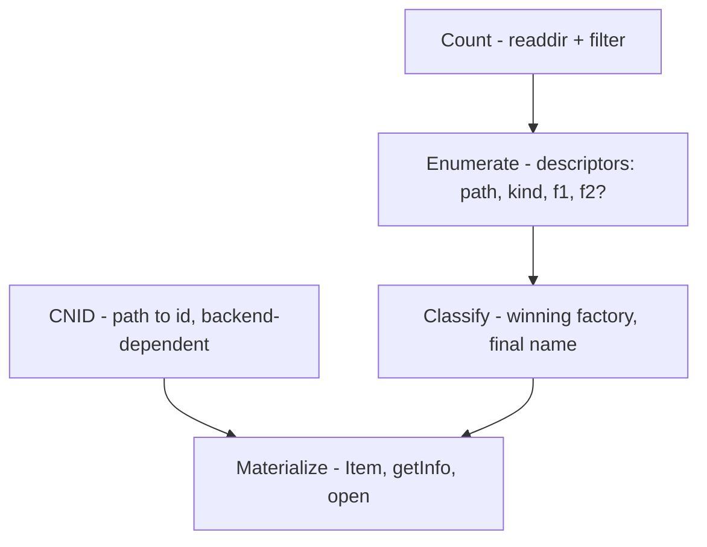

# Plan: staged materialization for `LocalVolume`

> **AI-generated.** This document was produced with the assistance of an AI
> language model and may contain inaccuracies. It is a *plan*, not a record of
> implemented behaviour.

- **Date:** 2026-10-08
- **Status:** Phase 0 done (test harness + instrumentation); refactor not started
- **Area:** `src/file/localvolume/`
- **Related:** `docs/subsystems/local-volume.md`,
  `docs/ai/2026-10-04-macbinary-localvolume-backend.md`

## Summary

Two performance problems in `LocalVolume` share one architectural cause: an
`Item` is all-or-nothing, and an `ItemCache` directory is either "cached" (fully
enumerated and every child realized as an `Item`) or "not cached". Everything —
assigning a CNID, reporting a directory's item count, and listing a directory —
collapses onto the single expensive "fully cache the whole directory" operation.

This plan replaces the two-state model with a set of **independently triggerable
stages**, each cheaper than the next and none requiring a later one:

| Stage | Scope | Cost | Enables |
|---|---|---|---|
| **Count** | directory | readdir + name filter | `ioDrNmFls` |
| **Enumerate** | directory | + name transforms | indexed listing, name candidates |
| **CNID** | entry | backend-dependent (slow with LMDB) | `dirID` / `parID` identity |
| **Classify** | entry, or collision cluster | `.bin` header / sidecar probes | final Mac name, winning factory |
| **Materialize** | entry | full `Item`, `getInfo`, `open` | metadata, forks, sizes |

The headline fixes are that **path resolution must not require any directory to
be enumerated**, and that **reporting a count must not require realizing the
directory's contents**. The name model below is what makes Enumerate content-free
and pushes classification to a lazy, collision-scoped stage.

## Findings (current behaviour)

### F1. Path resolution walks and fully caches every ancestor

`Executor::cmdlinePathToFSSpec` routes a host path (no `:`) to
`Executor::nativePathToFSSpec` (`src/file/fileMisc.cpp:245-251`), which calls
`LocalVolume::nativePathToFSSpec` (`src/file/localvolume/localvolume.cpp:867`).
That canonicalises the path (following the `result` symlink into `/nix/store/…`)
and calls `ItemCache::tryResolve(fs::path)` (`itemcache.cpp:169`).

`tryResolve(path)` walks the path component by component from the volume root and
calls `cacheDirectory(dir)` on **every ancestor**. Each `cacheDirectory`
(`itemcache.cpp:42`) does:

- one `directory_iterator` over the directory;
- `SimpleCNIDMapper::mapDirectoryContents` (`simplecnidmapper.cpp:18`) — sorts
  all entries and runs the batch CNID diff;
- `LocalVolume::createItemForDirEntry` (`localvolume.cpp:96`) for **every
  entry**, probing all factories: `fs::is_directory` / `fs::is_regular_file`
  stats, AppleSingle 8-byte magic read (`appledouble.cpp:117`), AppleDouble
  sidecar stats (`appledouble.cpp:30`), Basilisk `.rsrc`/`.finf` stats
  (`basilisk.cpp:16`), MacBinary 128-byte read + CRC for `.bin`
  (`macbinary.cpp:430`), then the plain fallback;
- `DirectoryItem::populateCache` (`item.cpp:67`) — upper-cases every name and
  inserts into an ordered `std::map`.

For `~/Projects/Executor/result/m68k/Dialog.bin` the canonical path is
`/nix/store/4ikmp1…-retro68.samples/Dialog.bin`, so the ancestors cached are
`/`, `/nix`, `/nix/store`, the hash directory, and `m68k`. `/nix/store` has
**296,240 entries** on this machine.

The volume root is `/` itself (`MountLocalVolumes`, `localvolume.cpp:944`), which
is what makes `/nix/store` reachable and subject to this.

### F2. Scope of the launch-time enumeration (does it recurse?)

No. Caching `/nix/store` enumerates **one level** and constructs an `Item` (CNID
+ Mac name) for each of its ~296,240 entries. A subdirectory entry becomes a
`DirectoryItem` (`item.cpp:49-57`) whose constructor only stores its fields;
`contents_` stays empty and `cache_valid_` stays `false`. Nothing recursively
calls `cacheDirectory` on the children. So launch cost is
O(entries in `/nix/store`), not O(entries in the whole subtree). The
subdirectories are enumerated only if/when the guest later navigates into them.

### F3. Reporting a directory's count forces full realization

`LocalVolume::getInfoCommon` (`localvolume.cpp:436`) reports the count as:

```cpp
itemCache->cacheDirectory(dirItem);
pb->dirInfo.ioDrNmFls = dirItem->countItems();   // == contents_.size()
```

`ioDrNmFls` can only be read from the fully materialized `contents_`
(`item.h:113`), so *asking for a count* costs the whole `cacheDirectory` path
above. Note this counts subdirectories as well as files, which matches HFS
`dirVal` (`hfsBtree.cpp:1625-1668` adjusts `dirVal` for both `regular` and
`directory` kinds) — so the count semantics are intentional and must be
preserved.

Consequence: when the guest lists a folder and asks each displayed subdirectory
for its `ioDrNmFls`, every one of those subdirectories is fully realized. That is
the "must cache every sub-directory to report the number of sub-items" problem.

### F4. The cache policy is a band-aid

`cleanDirectoryCache` (`itemcache.cpp:26`) evicts a directory after **1 second**
or when more than ~20 are cached. A directory larger than what can be built in
1 s is therefore rebuilt repeatedly during a single listing session — the exact
cost the LRU was meant to bound.

### F5. Mac names are batch-assigned and factories cannot rename

Names are chosen by the CNID mappers from the host filename during batch
enumeration (`simplecnidmapper.cpp:59-70`; LMDB equivalent
`lmdbcnidmapper.cpp:223-228`), with `#N` suffixed by `toMacRomanFilename(name,
index)` (`simplecnidmapper.cpp:66`) for collisions. `ItemCache::cacheDirectory`
hands the finished name to the factory (`itemcache.cpp:85`), so a factory cannot
override it. Content-derived names (an embedded filename in an AppleDouble /
AppleSingle / MacBinary header) are not used. See
`docs/ai/2026-10-04-macbinary-localvolume-backend.md`, Decision 1.

## Root cause

`ItemCache` / `DirectoryItem` fuse independent concerns:

| Concern | Currently requires |
|---|---|
| Host path → CNID | materializing every ancestor directory |
| Directory item count (`ioDrNmFls`) | materializing that directory |
| Directory listing | materializing that directory |
| Mac name | materializing that directory (batch) |

and `CNIDMapper` is batch-shaped (`mapDirectoryContents(dirID, allEntries)`)
because batch mode is *possible* only as a consequence of always caching a
directory whole. That batch requirement is an artifact, not an intrinsic need:
assigning a single entry a CNID needs only its parent id and its host path, and
a Mac name needs only the host basename plus, for `.bin` files, a one-file format
check. The mapper already stores each mapping's host path and reuses it across
enumerations, so identity itself is path-keyed; the enumeration dependency lives
in `ItemCache::tryResolve(fs::path)` (`itemcache.cpp:169`), which has no
path → CNID index and must enumerate each ancestor to find the child.

## Decisions

1. **Content-derived names are dead.** No name is ever read from an
   AppleDouble/AppleSingle/MacBinary header. All names are transformations of the
   host basename.
2. **Sidecars are always hidden by name**, independent of whether they are
   valid. `._`/`%` (AppleDouble) and `.rsrc`/`.finf` (Basilisk) are filtered
   purely from `readdir` output; no validity check is involved.
3. **CNID identity is path-determined and name-independent.** Identity is keyed by
   `(parID, posixFilename)`; a mapping is reused whenever the same entry is seen
   again. The Mac name does not determine the CNID and is **optional/undecided**
   until Classify computes it. (The mapper already reuses by path today; what is
   missing is the `(parID, posixFilename)` reverse index, not a change to identity
   semantics.)
4. **Name resolution is lazy and collision-scoped.** A `.bin` entry is classified
   when the name of **any entry in its collision cluster** is requested, not only
   its own.
5. **Cluster detection is conservative**, via a base key that strips `.bin` and
   any `#<digits>`, case-folds, and truncates to leave room for a disambiguator
   (see *Collision clusters*). Over-grouping is harmless: it costs laziness only,
   never a wrong name. Under-grouping is what to avoid.
6. **Disambiguation is assigned in catalog order**, making it deterministic; a
   later iteration persists the numbers in the CNID database (Phase 7). (Today
   the mapper assigns in host-path sort order — see open question 1.)
7. **Caching is validation-based**, not timer-based (see *Caching* below).
8. **Re-enumeration must not renumber or rename existing entries.** The current
   mapper already has this property (mappings are reused by path, so deleting a
   collision-set member leaves the survivors' names and CNIDs unchanged); the
   staged design must preserve it.
9. **Deciding a Mac name is a transaction.** Choosing final names is an atomic
   read-modify-write over the conflicting set — first approximation: the whole
   directory, refined later to a collision group. This is what lets concurrent
   writers converge and keeps previously assigned numbers stable (Phase 7).

## Name model

Because of Decisions 1–2, Enumerate can derive candidate names with **no file
I/O**:

```
for each non-hidden entry:
    f1 = toMacRomanFilename(basename)                      # identity transform
    f2 = toMacRomanFilename(basename minus ".bin") if basename ends in ".bin"
    candidates = { f1 } or { f1, f2 }
```

The final name is `f1` or `f2`, chosen by the **winning factory** at Classify:
MacBinary (magic check passes, and no sidecar/xattr backend won) → `f2`; every
other factory → `f1`. This is why the rule belongs to the factory, not to a
standalone extension check: a `foo.bin` with a `._foo.bin` companion is
AppleDouble and keeps `foo.bin`.

### Collision clusters

Rather than comparing candidate sets directly, cluster by a conservative **base
key** derived from the host basename:

1. strip a trailing `.bin` (case-insensitively);
2. strip a trailing `#<digits>` disambiguator;
3. apply the same transform as Mac names (`toMacRomanFilename`) and case-fold
   (the name index uses `ROMlib_UprString`, `item.cpp:77`);
4. truncate to the same cutoff `toMacRomanFilename` uses (`src/util/macstrings.cpp:204-268`):
   30 bytes + ellipsis for a plain name, or `30 - len("#<N>")` bytes + ellipsis
   + `#<N>` for a disambiguated one. Over-grouping from a fixed conservative
   bound is harmless.

Two entries are in the same cluster iff their base keys are equal. Stripping
*both* `.bin` and `#N` is what merges the cases that can actually collide: `foo`,
`foo.bin`, and a literal `foo#1` all reduce to the base `foo`, so a MacBinary
`foo.bin` that strips to `foo` is considered against both. Truncation is
deliberate over-grouping: names differing only past the truncation point would be
reduced to the same base once a disambiguator is appended. This also subsumes the
earlier transitive-closure concern (a generated `foo#1` versus a literal
`foo#1`), because the base key strips the `#N` from both sides.

Over-grouping is harmless — it can only force classification of a few extra
entries (less laziness), never a wrong name.

Within a cluster the final names are jointly determined, so:

> Classifying a `.bin` entry is required whenever the name of **any entry in its
> cluster** is requested — not merely its own name. (An earlier "one bit, needed
> only when that entry's own name is asked" was wrong.)

When any cluster member's name is first requested: classify **all** members, then
assign final names and `#N` numbers in **catalog order** (Decision 6; see open
question 1 for the exact order). A lone `.bin` is a singleton cluster and
classifies only itself. Non-`.bin` entries never need Classify for naming.

## Proposed direction: the stage ladder

Stages are independently triggerable and not a strict chain. In particular, path
resolution needs only CNID + Classify, and Count needs neither Enumerate nor
CNID.



### Count (per directory)

Goal: `ioDrNmFls` for a directory.

Needs: one `directory_iterator` + the name-predicate filter. Does **not** need
name transforms, CNID assignment, descriptors, `Item` construction, or factory
probing. This is the cheapest stage and must be reachable on its own.

`ioDrNmFls` is a snapshot by nature: HFS itself keeps a stored valence that can
go stale, and `LocalVolume` mirrors a *live* host directory that other programs
can change underneath it. Any consumer already races a
time-of-check/time-of-use window, so a cheap single-readdir count (or a cached
one, validated per *Caching*) is no less correct than today's value. Document the
staleness bound rather than pretending to exactness.

### Enumerate (per directory)

Goal: indexed `PBGetCatInfo` listing (`DirectoryItem::resolve(index,
includeDirectories)`, `item.cpp:111`), and the candidate sets Classify needs.

Needs: readdir + filter + name transforms. Output per entry:

```
(host path, kind, f1, f2?)
```

Still no CNID assignment, no factory probing, no `getInfo`, no fork layout. Kind
is a cheap check (or free from the dirent type); note `fs::is_directory` follows
symlinks (`item.cpp:52`).

### CNID (per entry)

Goal: assign or look up an item's CNID.

The lookup key is `(parent CNID, posixFilename)` — **not** a full host path.
Because traversal from the root always reaches the parent first, the parent's
CNID is already assigned, so a per-directory index composes into path resolution
without enumerating siblings; a direct posix-path → CNID index buys nothing on
its own. The Mac name is not needed here (Decision 3), so this stage is name-free.

Separate because the backend can be slow: `SimpleCNIDMapper` is in-memory, but a
persistent `LMDBCNIDMapper` (currently disabled, `localvolume.cpp:63-64`) pays
transaction cost per operation. Isolating it means the cost is paid only when a
`dirID` is actually needed, not on every scan.

### Classify (per entry, or per collision cluster)

Goal: the final Mac name, and which factory wins.

Needs: the entry's candidate set plus enough format detection to pick the winner
— for `.bin`: AppleSingle magic, AppleDouble/Basilisk sidecar stats, MacBinary
header + CRC (`macbinary.cpp:136`). Does **not** need `getInfo`, fork sizes, or a
full `Item`. Classify is a lightweight projection of Materialize.

Triggered when a cluster member's name is requested. Bounded to `.bin` files and
collision clusters.

### Materialize (per entry)

Goal: `getInfo`, `open`, `openRF`, sizes, Finder metadata.

Construct the concrete `Item` on demand and probe format-specific data on access
— not while scanning the directory. Move the eager per-entry work out of
`ItemFactory::createItemForDirEntry` (currently `localvolume.cpp:96`,
`appledouble.cpp:30/117`, `basilisk.cpp:16`, `macbinary.cpp:430`).

## Caching

Split the two jobs the current LRU + 1 s timeout (`itemcache.cpp:26`) conflates:

- **Memory bound** stays an LRU over realized items / enumerated directories.
  Eviction is now a pure memory concern.
- **Staleness** becomes explicit validation, so correctness no longer depends on
  timing:
  - **Membership**: `stat` the directory itself; if its mtime is unchanged since
    Enumerate, the entry list, candidate sets, and count are still valid — O(1).
  - **Per-entry**: escalate to re-reading the directory's `(filename, mtime)`
    list only when the directory mtime moved; this catches add/remove/rename and
    in-place edits (which directory mtime alone does not).
  - **Realized item**: on access, `stat` the item; if `(mtime, size)` differ from
    what was materialized, drop back to CNID/Classify.

This removes the 1 s / 20-directory policy entirely.

## Component changes (sketch)

### `CNIDMapper` (`cnidmapper.h`)

Backing store, per volume:

- `cnid -> { parID, posixFilename, macFilename?, mtime, (dev, inode) }` — the item
  record. Replace the cached `fs::directory_entry` with a plain path/filename and
  an explicit `mtime` snapshot, so the mapper owns what it validated.
  `macFilename` is **optional** until Classify decides it (Decisions 3/4).
  `(dev, inode)` is stored now for future rename tracking (Phase 8).
- `(parID, posixFilename) -> cnid` — the load-bearing index. It is also the
  directory content/diff index: enumerate a directory by looking up each host
  entry, and detect deletions as stored children not seen in the host scan. This
  replaces the current path-sorted `directories_` vector (no sort-merge needed for
  the diff).
- `(parID, macFilename) -> cnid` — **deferred** (needs its own per-file staleness
  rules; a Mac name can be reassigned between files). Until it exists, lookups by
  Mac name force enumeration via the existing `tryResolve`.

Operations:

- `getOrCreate(parID, posixFilename)` — name-free, per Decision 3.
- Batch re-enumeration reconciles against `(parID, posixFilename)`, reusing CNIDs
  and keeping already-decided `macFilename`s (Decision 8).
- Deciding `macFilename` is a **transaction** (Decision 9): an atomic
  read-modify-write over the conflicting set.

### `ItemCache` / `LocalVolume` (`itemcache.*`, `localvolume.cpp`)

- `ItemCache::tryResolve(fs::path)`: resolve via CNID only; do not call
  `cacheDirectory` on ancestors.
- `LocalVolume::nativePathToFSSpec` / `resolve(...)`: no ancestor enumeration;
  name for the FSSpec comes from Classify of that one entry.
- `getInfoCommon`'s directory branch (`localvolume.cpp:443-444`): use Count
  instead of `cacheDirectory` + `countItems()`.
- `resolve(name)` (`localvolume.cpp:170`): name lookup can no longer be a
  prebuilt map. Try the identity transform directly first (cheap), then scan
  candidates and Classify the relevant cluster.

### `Item` / `DirectoryItem` (`item.h`, `item.cpp`)

- `countChildren()` → Count (readdir + filter), validated per *Caching*.
- `enumerate()` → descriptors, replacing the eager
  `contents_`/`files_`/`contents_by_name_` construction in `populateCache`.
- `resolve(index, includeDirectories)` classifies/materializes only the
  requested child (and its cluster).
- Keep the HFS-compatible count semantics (files + directories).

### `ItemFactory` (`item.h`, per-format files)

- Give factories a naming hook (today `createItemForDirEntry` receives the
  finished name and cannot rename — F5). MacBinary returns the stripped name.
- Split "kind" (cheap) from "which fork layout" (expensive); the latter moves to
  first access.

## Design challenges / open questions

1. **Exact catalog order.** Define the deterministic order used for both listing
   and disambiguation (HFS orders by name; today the mapper assigns in host-path
   sort order). Confirm base-then-disambiguator is right and where the truncation
   is applied.
2. **Disambiguation transaction scope.** Whole-directory is the first
   approximation, a collision group the refinement. Define the read-modify-write
   and the convergence/retry rules so concurrent instances agree (Phase 7).
3. **Invalidation.** `create`/`delete`/`rename`/`move` (`itemcache.cpp:196-227`)
   currently flush whole directories; define how each invalidates Count /
   Enumerate / Classify while preserving CNID identity.
4. **External modification.** Reconciliation now happens at validation time
   (*Caching*) rather than only at the next full cache.

*Not* open: CNID and name stability across re-enumeration is already provided by
the mapper's match-by-path reuse, and is pinned by
`DisambiguatedNamesStableAcrossDelete`, `MoveKeepsDisambiguatedNameAndPosixName`
and `CnidStableAcrossRenameThenMove`. A new single-entry identity must simply
preserve it, not introduce it. Persistence/sharing is Phase 7; inode-based rename
tracking is Phase 8.

## Phased plan

### Phase 0 — Test harness and baseline (prerequisite) — DONE

Built the native harness:

- `tests/localvolume_ops.cpp` + `tests/localvolume_test_util.h`, added to
  `NATIVE_TEST_SOURCES`: listing, creation/deletion, move/rename, and interleaved
  host/FileManager sequences.
- Lightweight counters in `src/file/localvolume/stats.h`, wired into
  `itemcache.cpp` / `localvolume.cpp` (`directoryIterations`, `entriesSeen`,
  `itemsConstructed`, `factoryProbes`); `resetLocalVolumeStats()` for tests.
- A `DISABLED_` large-directory benchmark.

Result: `ctest --test-dir build -LE xfail` is green (159 tests, 4 new ones
`DISABLED_`). The suite is the safety net for Phases 1–5, so no refactor starts
until it is green — which it now is. One production bug surfaced in the process
and was fixed (*Phase 0 findings*).

Baseline (benchmark over an empty-file directory, `EXECUTOR_LV_BENCH_N=N`):
listing N files costs 1 directory scan, N items constructed, and **6N** factory
probes (all six factories are probed per file). At N=20000 the listing did not
finish within 5 minutes: the 1 s cache TTL forces repeated re-enumeration and
re-probing during a single listing — F4 in practice.

### Phase 0 findings

- **`PBCatMove` move-with-rename was broken — fixed.** `LocalVolume::PBCatMove`
  resolved `pb->ioNewName` as the new *parent directory*; `ioNewName` is the new
  item name and the destination directory is `ioNewDirID` (confirmed against
  `C_FSpCatMove`, `src/file/fileHighlevel.cpp:351`, which sets
  `ioNewName = dst->name`, `ioNewDirID = dst->parID`). With a non-null
  `ioNewName`, `resolve()` looked for an item of that name in the destination and
  failed (`fnfErr`); existing tests only ever passed `ioNewName = nullptr`. Fixed
  by resolving the destination from `ioNewDirID` and treating `ioNewName` as the
  optional new name (colon → `bdNamErr`, nil → keep), with the duplicate check
  ignoring the item itself; `ItemCache::moveItem` gained an optional `newName`.
  Covered by `LocalVolumeFixture.MoveAndRename` and `CatMoveRenamesWithinDirectory`.
- **Related, unfixed: the HFS backend has the same shape.** `hfsPBCatMove`
  (`src/hfs/hfsHier.cpp:266-270`) feeds `ioNewName` to `ROMlib_findvcbandfile`
  as the name to look up, so `FSpCatMove`/`PBCatMove` with a non-null
  `ioNewName` looks similarly broken there. Out of scope here (nothing tests it).
- **Listing a directory scans its subdirectories** (F3, confirmed): listing a
  directory with two subdirectories performs **three** `directory_iterator`
  scans, because `getInfoCommon` caches each returned child directory to read
  `ioDrNmFls`. Captured by `DISABLED_ListingDoesNotEnumerateSubdirectories`.
- **Name disambiguation is already stable across deletion** (contrary to
  expectation): with a collision set, deleting any member leaves the survivors'
  Mac names and CNIDs unchanged, because `SimpleCNIDMapper` keys mappings by
  host path and reuses them on re-enumeration. Covered by
  `LocalVolumeFixture.DisambiguatedNamesStableAcrossDelete`.

No production-code refactor happens before this phase is complete.

### Phase 1 — Path resolution without ancestor enumeration (fixes F1)

CNID stage with the `(parID, posixFilename) -> cnid` index, walking components
from the root, plus Classify for the final entry's name; route
`nativePathToFSSpec` / `resolve` through it. Deliverable: opening
`/nix/store/…/Dialog.bin` no longer touches `/nix/store`.
**Risk:** CNID assignment/name handling for lazily-identified entries.

### Phase 2 — Count without realization (fixes F3)

Count stage used for `ioDrNmFls`. Deliverable: listing a folder with many
subfolders no longer realizes each subfolder.
**Risk:** staleness policy for the count.

### Phase 3 — Enumerate descriptors without realization

Enumerate returns `(path, kind, f1, f2?)`; CNID assignment deferred out of
enumeration. Deliverable: scanning a directory no longer probes every file's
format.
**Risk:** the mapper no longer receives a whole-directory batch by default.

### Phase 4 — Classify and cluster-scoped naming

Implement Classify, the conservative base-key clustering, catalog-order
disambiguation, and the factory naming hook (MacBinary `.bin` stripping).
**Risk:** correctness of lazy name assignment; see open questions 1–2.

### Phase 5 — Lazy materialize

Split the factory gauntlet so format probing happens on access; keep the plain
fallback and the ordering rules from
`docs/ai/2026-10-04-macbinary-localvolume-backend.md` (sidecar backends, then
MacBinary, then plain).

### Phase 6 — Caching redesign

Replace the LRU + timeout with the validation scheme; keep an LRU for memory
only.

### Phase 7 — CNID persistence, transactions, multi-instance sharing

Re-enable `LMDBCNIDMapper` as the backing store: persist the `cnid -> record`
table and the `(parID, posixFilename) -> cnid` index, and make disambiguation a
**transactional read-modify-write** (whole directory first, collision group
later — Decision 9). With LMDB's single-writer model this lets two Executor
instances share CNID and disambiguation decisions for the same volume. Requires
the earlier phases to be fast enough to absorb LMDB's per-operation cost.

### Phase 8 — Inode-based rename tracking

Use the stored `(dev, inode)` to keep an item's CNID when its host file is
renamed outside the FileManager (an external rename currently looks like
delete + create, so it loses identity). Nothing above depends on this; it is a
separate phase.

## Testing

### Existing infrastructure

- `tests/files.cpp` — dual-mode: compiled natively (against the FileManager
  implementation) and under Retro68 (against Apple's headers). It must stay free
  of Executor internals, so it uses only the Mac FileManager ABI plus
  `compat.h`; its `FileTest` fixture creates/deletes one file in the default
  directory.
- `tests/files_internal.cpp` — native-only; uses ROMlib entry points
  (`nativePathToFSSpec`, `cmdlinePathToFSSpec`).
- `tests/localvolume_macbinary.cpp` — native-only; exercises backend functions
  directly, without the FileManager.
- `tests/main_executor.cpp` — global test environment: initialises Executor,
  calls `ROMlib_fileinit()` (which mounts `/` as a `LocalVolume`), and creates a
  temp directory opened as the default working directory. This is what makes a
  native test able to drive a real FileManager over a host tree.
- Build split: `NATIVE_TEST_SOURCES` vs `TEST_SOURCES` in `tests/CMakeLists.txt`;
  expected failures are labelled `xfail` in `tests/test-properties.cmake`.
- Suites: `ctest --test-dir build`; the Retro68 Mac-app suite is separate
  (`tests/build`, run `build/executor tests/build/tests.ad`).

### New native test module (prerequisite for the refactor)

Add `tests/localvolume_ops.cpp` to `NATIVE_TEST_SOURCES`. It drives the
FileManager against the mounted-`/` `LocalVolume` and interleaves host
(POSIX / `std::filesystem`) operations — the exact surface this refactor
threatens.

Shared native-only helpers in `tests/localvolume_test_util.h`:

- `LocalVolumeFixture` — per test, asks the FileManager to create a unique
  directory (`lvtest-…`) under the test environment's temporary working
  directory (`ExecutorTestTempDir`, exposed from `main_executor.cpp`), then
  builds a host tree inside it. All helpers take an explicit `(vRefNum, dirID)`
  and never change the process default directory. (The directory is created
  *through the FileManager*, not on the host, because host changes under an
  already-cached parent are not observed — see *Caching*.)
- Host helpers: `hostFile(rel, contents)`, `hostBytes(rel, bytes)`,
  `hostDir(rel)`, `hostList(rel)` (applying the `LocalVolume` hidden-name
  filter), `hostRead(rel)`.
- FileManager helpers, all with explicit `(vRefNum, dirID)`:
  `fmGet(parentDirID, name) -> {name, cnid, isDir}`, `fmMakeDir`, `fmCreateFile`,
  `fmDelete`, `fmRename`, `fmMove`, `fmList(dirID)` (`PBGetCatInfo` index loop,
  files + dirs), `fmListFiles(dirID)` (`PBHGetFInfo` index loop),
  `fmChildCount(dirID)` (`ioDrNmFls`).

### Coverage

- **Listing**: empty and non-empty directories; `fmList` vs `fmListFiles` vs
  `fmChildCount` consistency; `parID`/`dirID` relationships and CNID uniqueness;
  hidden sidecars (`._`, `%`, `.rsrc`, `.finf`) excluded from both listing and
  count; host trees populated before first enumeration are visible; FileManager
  mutations are reflected on the host.
- **Creation / deletion**: both directions; new directory CNID returned;
  duplicate name → `dupFNErr`; non-empty directory → `fBsyErr`; missing entry →
  `fnfErr`.
- **Move / rename**: `PBHRename` and `PBCatMove` (including move-with-rename
  and rename-within-directory) keep the CNID; the source listing drops the entry
  and the destination gains it; counts on both sides update; collisions →
  `dupFNErr`.
- **CNIDs and name disambiguation**: CNID survives rename → move
  (`CnidStableAcrossRenameThenMove`). A *truncation*-collision set (host names
  >31 bytes sharing a 30-byte prefix; the Mac name is 30 bytes + ellipsis, and a
  `#N` suffix shrinks the base to `30 - len("#N")`) is used so the tests do not
  depend on a case-sensitive host filesystem. Deleting any member leaves the
  survivors' names and CNIDs unchanged (`DisambiguatedNamesStableAcrossDelete`,
  all three deletion targets). Moving a disambiguated member with
  `ioNewName = nil` preserves the POSIX name, the disambiguated Mac name, and the
  CNID (`MoveKeepsDisambiguatedNameAndPosixName`). Case-only ambiguity is covered
  once and `GTEST_SKIP()`ped on a case-insensitive host FS
  (`CaseInsensitiveAmbiguity`).
- **Sequences**: interleavings of host and FileManager operations with
  assertions after each step (the strongest guard for caching/validation and
  CNID stability).
- **Instrumentation**: a directory is enumerated once and reused while cached
  (`ListingEnumeratesOnceWhileCached`).
- **Forward-looking** (`DISABLED_`, until the relevant phase): listing does not
  enumerate subdirectories (F3), host-side changes become visible without
  invalidation (*Caching*), MacBinary `.bin` stripping (Phase 4), and the
  large-directory benchmark.

### Benchmarks

Not CTest-gated: a micro-benchmark over a synthetic large directory to guard
against regressing F1/F3.

## Out of scope

- Changing how the volume root is chosen (`/`) or mounting behaviour.
- Re-enabling the LMDB mapper, except insofar as it affects Phase 7.
- HFS backend behaviour.

## References

- `src/file/localvolume/itemcache.cpp` — `tryResolve(path)`, `cacheDirectory`, LRU.
- `src/file/localvolume/localvolume.cpp` — `nativePathToFSSpec`, `getInfoCommon`,
  `createItemForDirEntry`, `resolve`, `MountLocalVolumes`.
- `src/file/localvolume/item.cpp` / `item.h` — `DirectoryItem::populateCache`,
  `resolve`, `countItems`.
- `src/file/localvolume/simplecnidmapper.cpp` /
  `lmdbcnidmapper.cpp` — batch mapping, `toMacRomanFilename`.
- `src/file/localvolume/macbinary.cpp` — `isMacBinaryFile` (the `.bin` check).
- `src/hfs/hfsBtree.cpp` — `dirVal` / `ioDrNmFls` semantics.
- `src/util/macstrings.cpp` — `toMacRomanFilename`.
- `docs/subsystems/local-volume.md`, `docs/subsystems/file-manager.md`,
  `docs/ai/2026-10-04-macbinary-localvolume-backend.md`.
